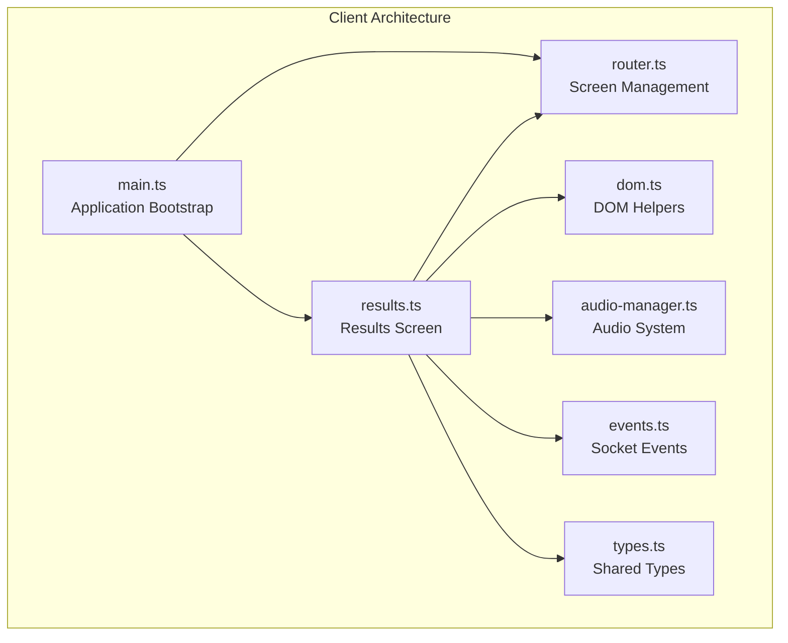
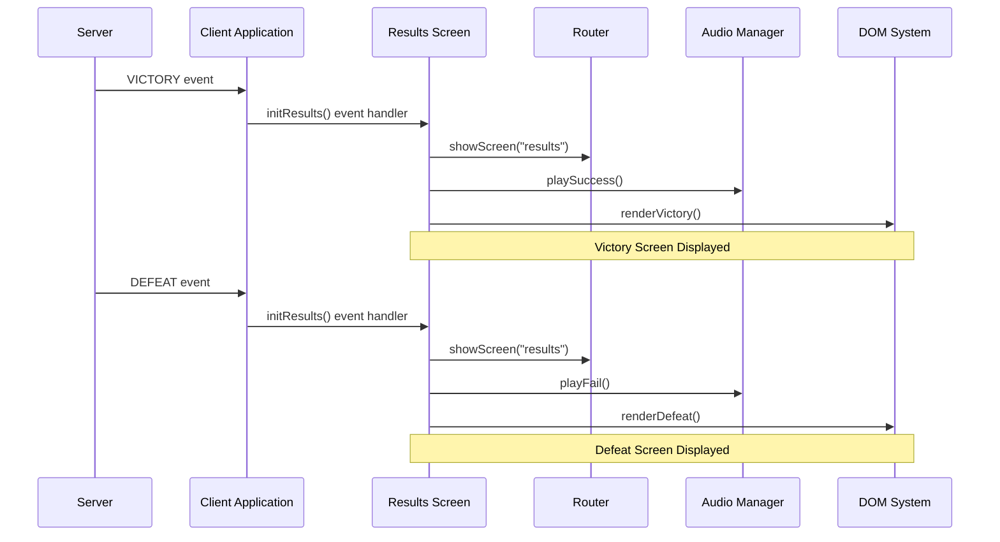
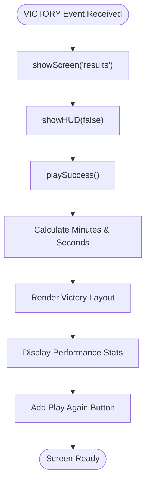
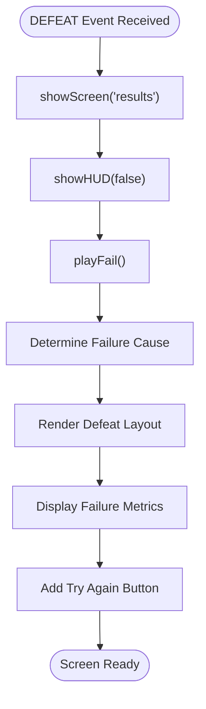
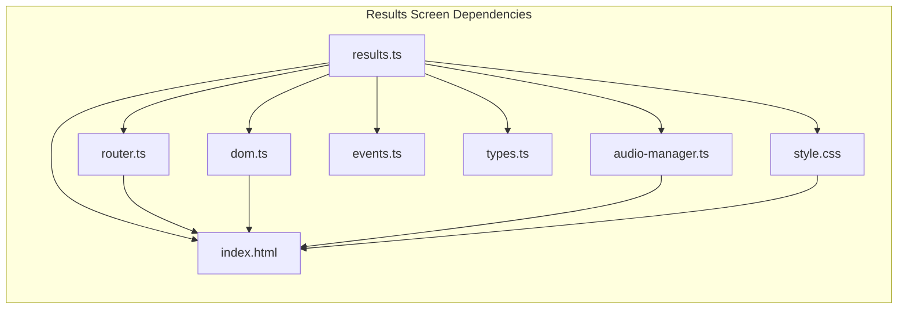

# Results Screen

<cite>
**Referenced Files in This Document**
- [results.ts](file://src/client/screens/results.ts)
- [main.ts](file://src/client/main.ts)
- [router.ts](file://src/client/lib/router.ts)
- [dom.ts](file://src/client/lib/dom.ts)
- [audio-manager.ts](file://src/client/audio/audio-manager.ts)
- [events.ts](file://shared/events.ts)
- [types.ts](file://shared/types.ts)
- [index.html](file://src/client/index.html)
- [style.css](file://src/client/styles/style.css)
- [puzzle.ts](file://src/client/screens/puzzle.ts)
</cite>

## Table of Contents
1. [Introduction](#introduction)
2. [Project Structure](#project-structure)
3. [Core Components](#core-components)
4. [Architecture Overview](#architecture-overview)
5. [Detailed Component Analysis](#detailed-component-analysis)
6. [Dependency Analysis](#dependency-analysis)
7. [Performance Considerations](#performance-considerations)
8. [Troubleshooting Guide](#troubleshooting-guide)
9. [Conclusion](#conclusion)

## Introduction

The Results Screen is the final screen in Project ODYSSEY's escape room experience, displaying either victory or defeat outcomes to players after completing a mission. This screen serves as the culmination of the gaming experience, providing players with their performance metrics and offering options to continue playing.

The Results Screen is designed with a cyberpunk aesthetic that matches the game's overall theme, featuring neon color schemes, glitch effects, and responsive animations. It presents players with detailed statistics about their performance, including completion time, glitch levels, puzzles solved, and final scores.

## Project Structure

The Results Screen is part of the client-side architecture built with vanilla TypeScript and manual DOM manipulation. The screen follows a modular design pattern where each screen has its own initialization function and lifecycle management.

**Diagram sources**
- [main.ts](file://src/client/main.ts#L36-L72)
- [results.ts](file://src/client/screens/results.ts#L1-L96)

**Section sources**
- [main.ts](file://src/client/main.ts#L36-L72)
- [results.ts](file://src/client/screens/results.ts#L1-L11)

## Core Components

The Results Screen consists of several interconnected components that work together to deliver the final gaming experience:

### Screen Initialization
The Results Screen is initialized during the application boot process alongside other screens. The initialization function sets up event listeners for both victory and defeat scenarios.

### Event Handling System
The screen listens for two primary server events:
- `VICTORY`: Triggered when players successfully complete the mission
- `DEFEAT`: Triggered when players fail to complete the mission

### Rendering Engine
The screen uses a lightweight DOM rendering system that creates HTML elements programmatically, avoiding the need for a full framework.

### Audio Integration
The Results Screen integrates with the audio system to provide appropriate sound feedback for both victory and defeat scenarios.

**Section sources**
- [results.ts](file://src/client/screens/results.ts#L12-L22)
- [events.ts](file://shared/events.ts#L77-L80)

## Architecture Overview

The Results Screen operates within a larger client-server architecture where the server manages game state and sends event notifications to clients. The screen acts as a presentation layer that interprets server events and renders appropriate user interfaces.

**Diagram sources**
- [results.ts](file://src/client/screens/results.ts#L13-L21)
- [main.ts](file://src/client/main.ts#L47-L72)

The architecture follows a unidirectional data flow where server events drive client state changes, and the Results Screen responds to these events by updating the user interface accordingly.

**Section sources**
- [results.ts](file://src/client/screens/results.ts#L1-L96)
- [main.ts](file://src/client/main.ts#L14-L41)

## Detailed Component Analysis

### Results Screen Implementation

The Results Screen is implemented as a single module that handles both victory and defeat scenarios through a unified interface. The implementation uses functional programming patterns with clear separation of concerns.

#### Victory Screen Rendering

The victory screen displays a success message with a green neon theme, indicating successful completion of the mission. The screen presents key performance metrics in an organized card layout.

**Diagram sources**
- [results.ts](file://src/client/screens/results.ts#L24-L55)

#### Defeat Screen Rendering

The defeat screen uses a red neon theme and provides contextual information about the cause of failure. The screen displays different metrics depending on whether the failure was due to time expiration or glitch overload.

**Diagram sources**
- [results.ts](file://src/client/screens/results.ts#L57-L88)

#### Statistical Display System

Both victory and defeat screens present statistical information in a consistent card-based layout. The stat cards display key metrics that help players understand their performance.

**Section sources**
- [results.ts](file://src/client/screens/results.ts#L24-L88)

### DOM Manipulation System

The Results Screen uses a lightweight DOM manipulation library that provides essential functionality for creating and managing HTML elements without requiring a full framework.

#### Element Creation and Management

The DOM system provides functions for creating elements with attributes, querying elements, and managing content. These functions are used extensively throughout the Results Screen implementation.

#### Event Handling Integration

The DOM system integrates with the broader application event handling system, allowing the Results Screen to respond to user interactions and server events seamlessly.

**Section sources**
- [dom.ts](file://src/client/lib/dom.ts#L11-L44)
- [results.ts](file://src/client/screens/results.ts#L32-L54)

### Audio Integration

The Results Screen integrates with the audio system to provide appropriate sound feedback for different game outcomes. The audio system uses the Web Audio API for high-quality sound generation.

#### Success and Failure Sounds

The audio system generates distinct sounds for victory and defeat scenarios using synthesized tones. These sounds enhance the immersive experience and provide immediate feedback to players.

#### Sound Management

The audio system manages sound buffers, playback contexts, and volume controls. It handles browser autoplay policies and provides fallback mechanisms for audio loading failures.

**Section sources**
- [audio-manager.ts](file://src/client/audio/audio-manager.ts#L142-L187)
- [results.ts](file://src/client/screens/results.ts#L27-L60)

### Screen Navigation System

The Results Screen participates in the application's screen navigation system, which manages the visibility and state of different screens throughout the game.

#### Screen Lifecycle Management

The navigation system maintains the current screen state and coordinates the transition between different screens. The Results Screen is designed to be displayed after puzzle completion or failure.

#### Visual Effects Coordination

The navigation system integrates with the visual effects system to manage screen transitions and maintain consistent visual themes across different game states.

**Section sources**
- [router.ts](file://src/client/lib/router.ts#L17-L39)
- [results.ts](file://src/client/screens/results.ts#L25-L59)

## Dependency Analysis

The Results Screen has several key dependencies that contribute to its functionality and integration within the larger application architecture.

**Diagram sources**
- [results.ts](file://src/client/screens/results.ts#L5-L10)
- [router.ts](file://src/client/lib/router.ts#L1-L10)

### External Dependencies

The Results Screen relies on several external libraries and systems:

- **Socket.io Client**: Handles real-time communication with the server
- **Web Audio API**: Provides sound synthesis and playback capabilities
- **DOM APIs**: Standard browser APIs for element manipulation
- **CSS Custom Properties**: Dynamic theming and styling system

### Internal Dependencies

The Results Screen integrates with several internal modules:

- **Event System**: Type-safe event definitions and payload interfaces
- **Type System**: Shared data structures and interfaces
- **Navigation System**: Screen management and routing
- **Audio System**: Sound effects and background music

**Section sources**
- [results.ts](file://src/client/screens/results.ts#L5-L10)
- [events.ts](file://shared/events.ts#L14-L90)

## Performance Considerations

The Results Screen is designed with performance optimization in mind, particularly considering the constraints of real-time applications and varying hardware capabilities.

### Memory Management

The screen uses efficient memory management techniques by:
- Creating elements on-demand rather than preallocating large structures
- Reusing DOM nodes through the mounting system
- Cleaning up event listeners when screens change

### Rendering Optimization

The rendering system minimizes DOM manipulation overhead by:
- Using a single container element for screen content
- Leveraging CSS animations for visual effects
- Avoiding unnecessary reflows and repaints

### Audio Performance

The audio system optimizes performance through:
- Buffering frequently used sounds
- Managing audio context lifecycle efficiently
- Using Web Audio API for precise timing control

## Troubleshooting Guide

Common issues and solutions for the Results Screen implementation:

### Screen Not Displaying

**Symptoms**: Results screen appears blank or doesn't show up after game completion
**Causes**: 
- Missing screen element in HTML
- Incorrect event handling
- Navigation system errors

**Solutions**:
- Verify `#screen-results` element exists in index.html
- Check event listener registration in initResults()
- Ensure showScreen() is called with correct parameters

### Audio Not Playing

**Symptoms**: No sound effects when reaching results screen
**Causes**:
- Browser autoplay restrictions
- Audio context not resumed
- Sound files not loaded

**Solutions**:
- Implement user gesture requirement for audio context
- Use resumeContext() on first interaction
- Verify sound files are accessible and properly cached

### Styling Issues

**Symptoms**: Results screen appears unstyled or incorrectly formatted
**Causes**:
- Missing CSS classes
- Conflicting styles
- Responsive design problems

**Solutions**:
- Verify all required CSS classes are present
- Check for CSS specificity conflicts
- Test responsive breakpoints

**Section sources**
- [results.ts](file://src/client/screens/results.ts#L24-L88)
- [index.html](file://src/client/index.html#L36-L38)
- [style.css](file://src/client/styles/style.css#L561-L712)

## Conclusion

The Results Screen represents a well-architected component within Project ODYSSEY's client-side architecture. It demonstrates clean separation of concerns, efficient resource management, and seamless integration with the broader application ecosystem.

The screen successfully balances functionality with performance, providing players with meaningful feedback about their gaming experience while maintaining optimal resource utilization. Its modular design allows for easy maintenance and potential enhancements without disrupting other system components.

The Results Screen serves as an excellent example of how to implement complex UI functionality using vanilla JavaScript and modern web technologies, avoiding the overhead of full frameworks while maintaining code quality and developer productivity.