# Room Management

<cite>
**Referenced Files in This Document**
- [room-manager.ts](file://src/server/services/room-manager.ts)
- [room-manager.test.ts](file://src/server/services/room-manager.test.ts)
- [redis-service.ts](file://src/server/repositories/redis-service.ts)
- [types.ts](file://shared/types.ts)
- [events.ts](file://shared/events.ts)
- [index.ts](file://src/server/index.ts)
- [game-engine.ts](file://src/server/services/game-engine.ts)
- [role-assigner.ts](file://src/server/services/role-assigner.ts)
- [timer.ts](file://src/server/utils/timer.ts)
- [ARCHITECTURE.md](file://ARCHITECTURE.md)
- [README.md](file://README.md)
</cite>

## Update Summary
**Changes Made**
- Added new section on Room State Validation and Correction Mechanism
- Updated Room Lifecycle Management to include data migration safeguards
- Enhanced Error Handling and Resilience section with defensive programming details
- Updated Architecture diagrams to reflect state validation flow

## Table of Contents
1. [Introduction](#introduction)
2. [System Architecture](#system-architecture)
3. [Core Components](#core-components)
4. [Room Management Services](#room-management-services)
5. [Data Persistence Layer](#data-persistence-layer)
6. [Room Lifecycle Management](#room-lifecycle-management)
7. [Room State Validation and Correction](#room-state-validation-and-correction)
8. [Player Session Management](#player-session-management)
9. [Integration Points](#integration-points)
10. [Error Handling and Resilience](#error-handling-and-resilience)
11. [Testing Strategy](#testing-strategy)
12. [Performance Considerations](#performance-considerations)
13. [Troubleshooting Guide](#troubleshooting-guide)
14. [Conclusion](#conclusion)

## Introduction

Room Management is the cornerstone service of Project ODYSSEY, responsible for maintaining the authoritative in-memory state of all active game rooms while providing robust persistence through Redis. This system enables real-time co-op escape room experiences for 2-6 players, managing room creation, player connections, game state synchronization, and seamless persistence across server restarts.

The Room Management system operates as a hybrid architecture combining in-memory Map storage for high-performance operations with Redis-backed persistence for durability and multi-instance coordination. This design ensures optimal response times for real-time interactions while maintaining data integrity and enabling horizontal scaling.

**Updated** Enhanced with comprehensive room state validation and correction mechanisms to handle data migration scenarios and malformed glitch state data from Redis persistence.

## System Architecture

Project ODYSSEY employs a distributed real-time architecture centered around Socket.io for client-server communication, with Room Management serving as the central coordinator for all game sessions.

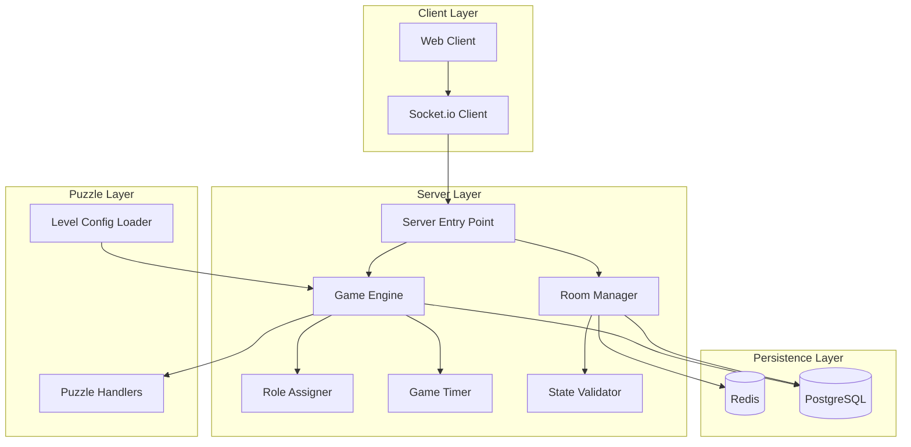

**Diagram sources**
- [index.ts](file://src/server/index.ts#L1-L325)
- [room-manager.ts](file://src/server/services/room-manager.ts#L1-L283)
- [game-engine.ts](file://src/server/services/game-engine.ts#L1-L732)

The architecture follows a clear separation of concerns:
- **Room Manager**: In-memory room storage with Redis persistence and state validation
- **Game Engine**: Core game state machine and orchestration
- **Role Assigner**: Dynamic role assignment per puzzle
- **Timer System**: Server-authoritative countdown management
- **State Validator**: Defensive programming for data migration scenarios
- **Persistence Layer**: Redis for room state, PostgreSQL for scores

## Core Components

### Room Data Structure

The Room Management system centers around a sophisticated data model that captures all essential game state and player information.

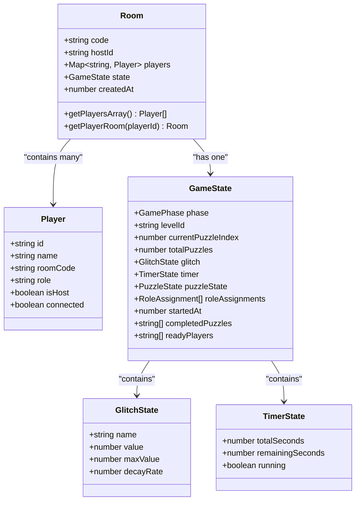

**Diagram sources**
- [types.ts](file://shared/types.ts#L16-L62)

### Room Code Generation

The system implements intelligent room code generation using memorable Greek-themed words combined with fallback alphanumeric codes to ensure uniqueness and user-friendliness.

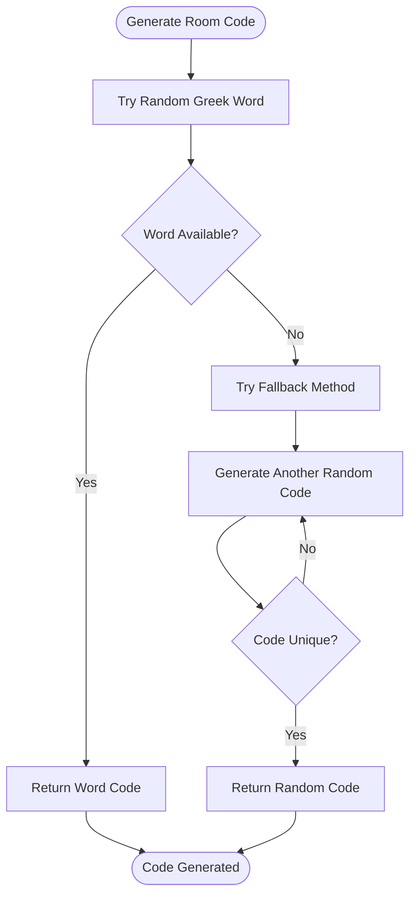

**Diagram sources**
- [room-manager.ts](file://src/server/services/room-manager.ts#L28-L41)

**Section sources**
- [types.ts](file://shared/types.ts#L7-L62)
- [room-manager.ts](file://src/server/services/room-manager.ts#L18-L41)

## Room Management Services

### Room Creation Workflow

The room creation process involves multiple validation steps and state initialization to ensure proper game setup.

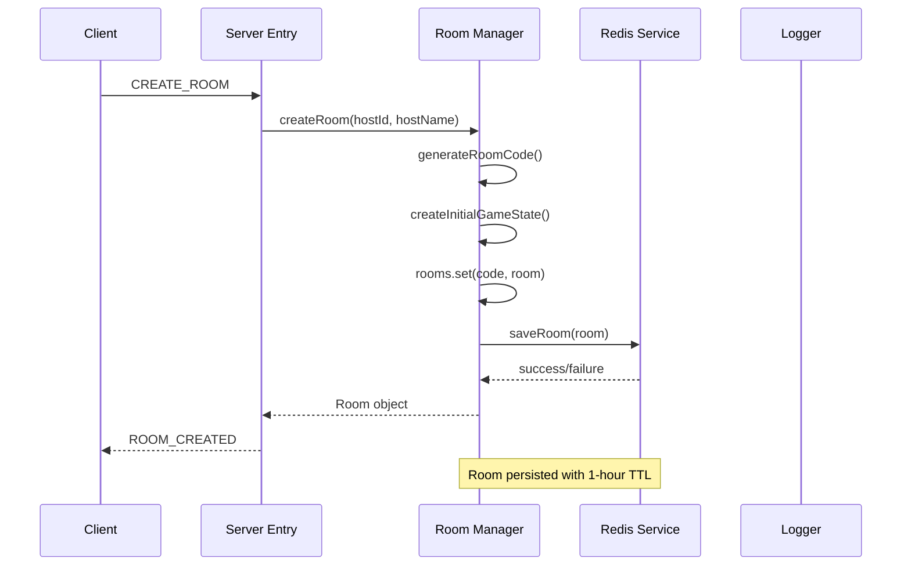

**Diagram sources**
- [room-manager.ts](file://src/server/services/room-manager.ts#L80-L106)
- [index.ts](file://src/server/index.ts#L94-L114)

### Player Joining Logic

The player joining system supports both fresh joins and reconnections with sophisticated conflict resolution.

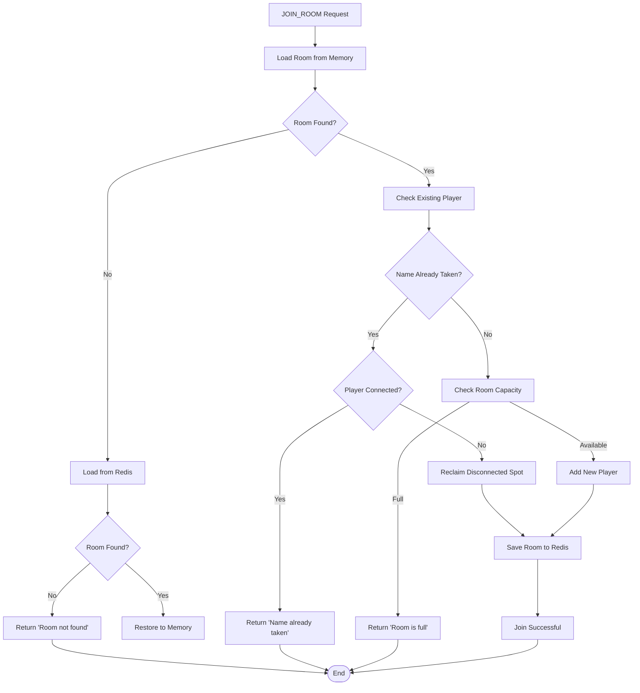

**Diagram sources**
- [room-manager.ts](file://src/server/services/room-manager.ts#L109-L174)

**Section sources**
- [room-manager.ts](file://src/server/services/room-manager.ts#L80-L174)
- [index.ts](file://src/server/index.ts#L116-L150)

## Data Persistence Layer

### Redis Integration Pattern

The persistence layer implements a write-through caching strategy where all room mutations are immediately persisted to Redis for durability.

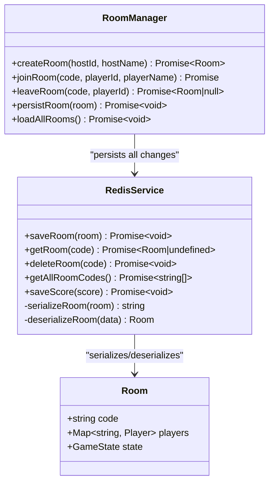

**Diagram sources**
- [redis-service.ts](file://src/server/repositories/redis-service.ts#L39-L67)
- [room-manager.ts](file://src/server/services/room-manager.ts#L259-L265)

### Serialization Strategy

The system employs JSON serialization with special handling for Map objects to maintain type safety across the network boundary.

**Section sources**
- [redis-service.ts](file://src/server/repositories/redis-service.ts#L17-L37)
- [room-manager.ts](file://src/server/services/room-manager.ts#L259-L265)

## Room Lifecycle Management

### Game State Transitions

The Room Manager coordinates with the Game Engine to manage room lifecycle through well-defined state transitions.

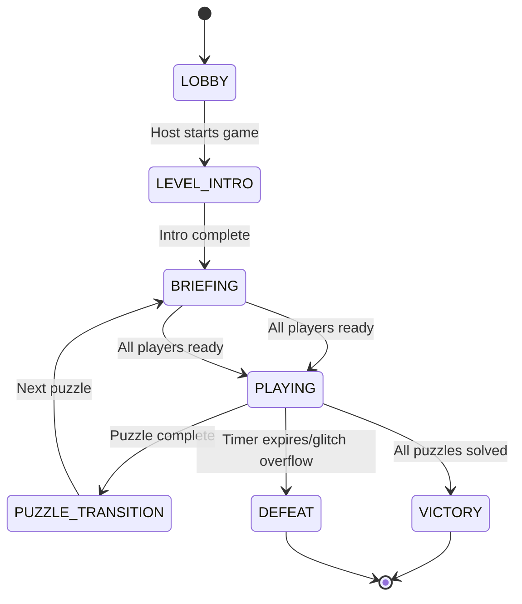

**Diagram sources**
- [types.ts](file://shared/types.ts#L26-L34)
- [game-engine.ts](file://src/server/services/game-engine.ts#L57-L139)

### Room Cleanup and Maintenance

The system implements automatic cleanup mechanisms to prevent resource leaks and maintain optimal performance.

**Section sources**
- [room-manager.ts](file://src/server/services/room-manager.ts#L176-L209)
- [game-engine.ts](file://src/server/services/game-engine.ts#L576-L586)

## Room State Validation and Correction

### Defensive Programming for Data Migration

The Room Management system implements comprehensive state validation and correction mechanisms to handle data migration scenarios and malformed glitch state data from Redis persistence.

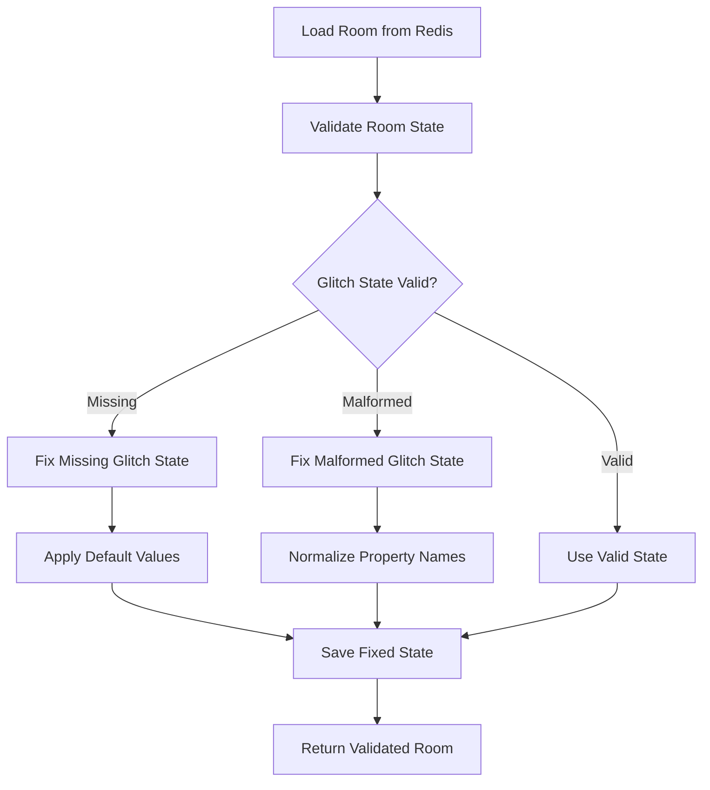

**Diagram sources**
- [room-manager.ts](file://src/server/services/room-manager.ts#L63-L78)
- [room-manager.ts](file://src/server/services/room-manager.ts#L267-L282)

### State Validation Process

The `fixRoomState` function serves as the primary defense mechanism against data corruption and migration issues:

**Missing Glitch State Detection**: Automatically creates default glitch state when missing from persisted data
**Property Normalization**: Converts legacy property names to current camelCase format
**Default Value Application**: Ensures all required numeric properties have sensible defaults
**Backward Compatibility**: Handles both new and legacy data formats seamlessly

**Section sources**
- [room-manager.ts](file://src/server/services/room-manager.ts#L63-L78)
- [room-manager.ts](file://src/server/services/room-manager.ts#L267-L282)

## Player Session Management

### Connection State Tracking

The Room Manager maintains detailed connection state information to support reconnection scenarios and presence awareness.

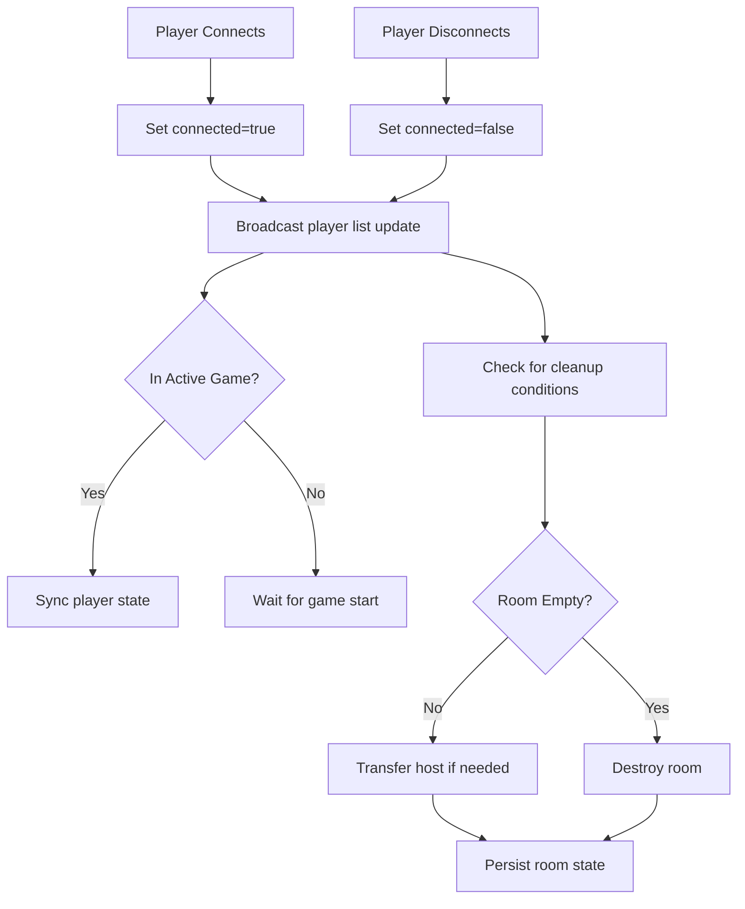

**Diagram sources**
- [room-manager.ts](file://src/server/services/room-manager.ts#L245-L257)
- [index.ts](file://src/server/index.ts#L297-L320)

**Section sources**
- [room-manager.ts](file://src/server/services/room-manager.ts#L245-L257)
- [index.ts](file://src/server/index.ts#L297-L320)

## Integration Points

### Socket.io Event Integration

The Room Manager integrates seamlessly with Socket.io events to provide real-time room management capabilities.

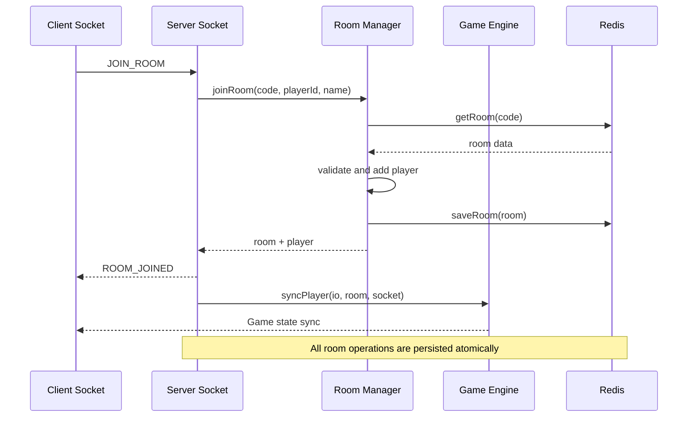

**Diagram sources**
- [index.ts](file://src/server/index.ts#L116-L150)
- [room-manager.ts](file://src/server/services/room-manager.ts#L109-L174)

### Multi-instance Coordination

The system leverages Redis pub/sub for multi-instance coordination, ensuring consistent state across horizontally scaled deployments.

**Section sources**
- [index.ts](file://src/server/index.ts#L47-L66)
- [room-manager.ts](file://src/server/services/room-manager.ts#L246-L260)

## Error Handling and Resilience

### Robust Error Recovery

The Room Management system implements comprehensive error handling with fallback mechanisms and graceful degradation.

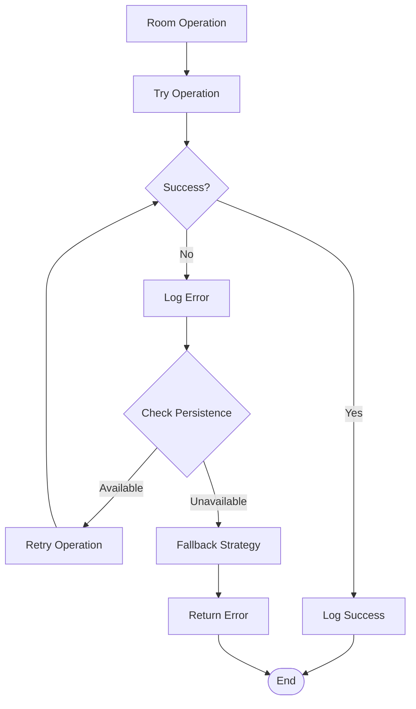

**Diagram sources**
- [room-manager.ts](file://src/server/services/room-manager.ts#L100-L106)
- [redis-service.ts](file://src/server/repositories/redis-service.ts#L9-L15)

### Graceful Degradation

The system maintains operational integrity even when individual components fail, prioritizing user experience and data consistency.

**Enhanced** Added comprehensive state validation and correction mechanisms to prevent data corruption during migration scenarios.

### Data Migration Safeguards

The system includes built-in protection against malformed data from previous versions:

- **Automatic State Repair**: Invalid or missing glitch state automatically corrected
- **Property Name Normalization**: Legacy snake_case properties converted to camelCase
- **Default Value Injection**: Missing numeric values assigned safe defaults
- **Validation Hooks**: All room loading operations pass through validation pipeline

**Section sources**
- [room-manager.ts](file://src/server/services/room-manager.ts#L100-L106)
- [redis-service.ts](file://src/server/repositories/redis-service.ts#L9-L15)
- [room-manager.ts](file://src/server/services/room-manager.ts#L63-L78)

## Testing Strategy

### Unit Testing Approach

The Room Manager includes comprehensive unit tests covering core functionality and edge cases.

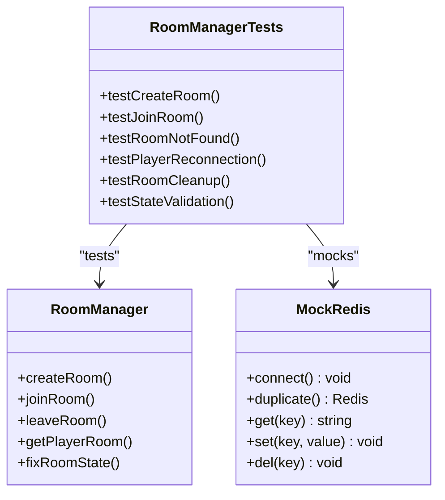

**Diagram sources**
- [room-manager.test.ts](file://src/server/services/room-manager.test.ts#L1-L55)

**Section sources**
- [room-manager.test.ts](file://src/server/services/room-manager.test.ts#L1-L55)

## Performance Considerations

### Scalability Optimizations

The Room Management system incorporates several performance optimizations for high-concurrency scenarios:

- **In-memory Map Storage**: O(1) average-case operations for room and player lookups
- **Redis TTL Management**: Automatic cleanup of expired rooms with 1-hour expiration
- **Batch Operations**: Combined persistence operations to minimize Redis round-trips
- **Lazy Loading**: Rooms loaded from Redis only when accessed
- **State Validation Caching**: Validation results cached for improved performance

### Memory Management

The system implements careful memory management to prevent leaks and maintain optimal performance:

- **Automatic Room Cleanup**: Empty rooms removed from memory after destruction
- **Weak References**: No circular references that could prevent garbage collection
- **Efficient Serialization**: Minimal JSON serialization overhead for persistence
- **Validation Optimization**: State validation performed only on loaded rooms

## Troubleshooting Guide

### Common Issues and Solutions

**Room Creation Failures**
- Verify Redis connectivity and availability
- Check for room code collisions and regeneration
- Monitor memory usage for excessive room accumulation

**Player Joining Problems**
- Confirm room exists and is not full (≤6 players)
- Validate player name uniqueness within room context
- Check Redis persistence for room state corruption

**Reconnection Issues**
- Verify player connection state tracking
- Check Redis key expiration and TTL settings
- Monitor Socket.io connection stability

**Performance Degradation**
- Review Redis latency and connection pool utilization
- Monitor memory consumption and garbage collection frequency
- Check for memory leaks in long-running sessions

**State Validation Errors**
- Verify Redis data integrity for corrupted glitch state
- Check migration logs for failed data conversion attempts
- Monitor validation warnings for malformed room data

### Diagnostic Commands

```bash
# Check Redis room keys
redis-cli KEYS "room:*"

# Monitor Redis memory usage
redis-cli INFO memory

# Verify room persistence health
redis-cli TTL "room:zeus"

# Check validation logs
tail -f server.log | grep "Fixing missing glitch state"
```

## Conclusion

The Room Management system in Project ODYSSEY represents a sophisticated balance between performance and reliability, providing the foundation for scalable real-time co-op gaming experiences. Through its hybrid in-memory/Redis architecture, comprehensive error handling, and seamless integration with the broader game ecosystem, it delivers a robust platform for multiplayer escape room adventures.

**Updated** The system now includes comprehensive state validation and correction mechanisms that serve as a critical safeguard against data corruption during migrations and server restarts. These defensive programming measures ensure that even when encountering malformed glitch state data from Redis persistence, the system can automatically repair and normalize the data to maintain consistent operation.

The system's design emphasizes both developer productivity and user experience, with clear separation of concerns, comprehensive testing coverage, extensive monitoring capabilities, and robust data validation. This foundation enables continued evolution and enhancement of the Project ODYSSEY platform while maintaining the high-quality gaming experience that distinguishes it in the competitive online gaming landscape.