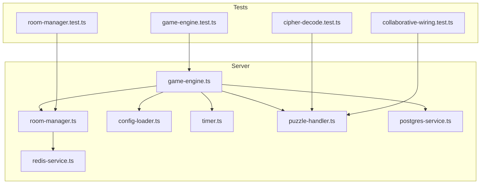
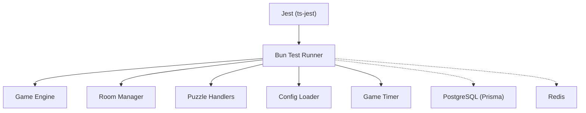
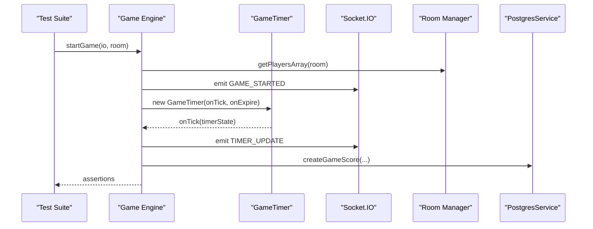
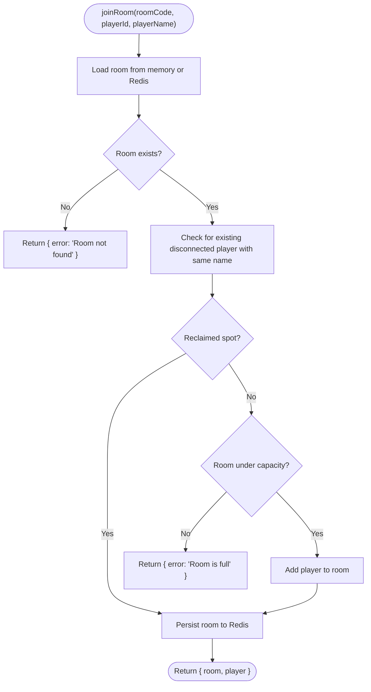
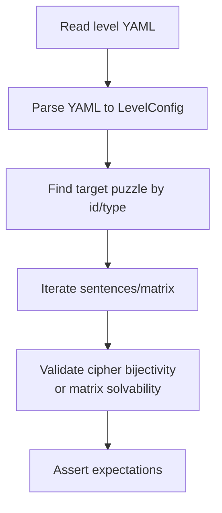
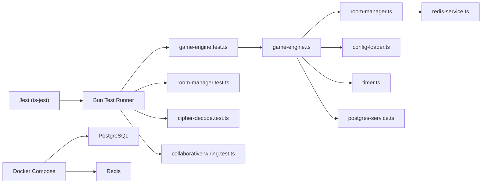

# Testing Strategy

<cite>
**Referenced Files in This Document**
- [TESTING.md](file://TESTING.md)
- [jest.config.js](file://jest.config.js)
- [package.json](file://package.json)
- [docker-compose.yml](file://docker-compose.yml)
- [src/server/services/game-engine.test.ts](file://src/server/services/game-engine.test.ts)
- [src/server/puzzles/cipher-decode.test.ts](file://src/server/puzzles/cipher-decode.test.ts)
- [src/server/puzzles/collaborative-wiring.test.ts](file://src/server/puzzles/collaborative-wiring.test.ts)
- [src/server/services/room-manager.test.ts](file://src/server/services/room-manager.test.ts)
- [src/server/services/game-engine.ts](file://src/server/services/game-engine.ts)
- [src/server/services/room-manager.ts](file://src/server/services/room-manager.ts)
- [src/server/repositories/postgres-service.ts](file://src/server/repositories/postgres-service.ts)
- [src/server/repositories/redis-service.ts](file://src/server/repositories/redis-service.ts)
- [src/server/utils/timer.ts](file://src/server/utils/timer.ts)
- [src/server/utils/config-loader.ts](file://src/server/utils/config-loader.ts)
- [src/server/puzzles/puzzle-handler.ts](file://src/server/puzzles/puzzle-handler.ts)
- [shared/types.ts](file://shared/types.ts)
</cite>

## Table of Contents
1. [Introduction](#introduction)
2. [Project Structure](#project-structure)
3. [Core Components](#core-components)
4. [Architecture Overview](#architecture-overview)
5. [Detailed Component Analysis](#detailed-component-analysis)
6. [Dependency Analysis](#dependency-analysis)
7. [Performance Considerations](#performance-considerations)
8. [Troubleshooting Guide](#troubleshooting-guide)
9. [Conclusion](#conclusion)
10. [Appendices](#appendices)

## Introduction
This document defines Project ODYSSEY’s testing strategy and implementation. The project uses Bun’s built-in test runner for unit and integration tests, with complementary Jest configuration for type checking and coverage collection. Tests are co-located with source files, ensuring maintainability and discoverability. The strategy emphasizes:
- Unit tests for game engine logic, puzzle implementations, and service layers
- Integration tests validating real-time communication, database operations, and client-server synchronization
- Mock strategies for external dependencies (Redis and PostgreSQL)
- Patterns for asynchronous operations, event handling, and state management
- Coverage requirements, CI workflows, and automated testing procedures
- Performance and load testing guidance, plus practical guidelines for writing effective tests

## Project Structure
The repository organizes tests alongside source code using the .test.ts suffix. The primary testing surface spans:
- Game engine orchestration and state transitions
- Room management and persistence
- Puzzle handler registry and individual puzzle logic
- Real-time communication via Socket.IO
- Persistence via Redis and PostgreSQL

**Diagram sources**
- [src/server/services/game-engine.ts](file://src/server/services/game-engine.ts#L1-L711)
- [src/server/services/room-manager.ts](file://src/server/services/room-manager.ts#L1-L262)
- [src/server/utils/config-loader.ts](file://src/server/utils/config-loader.ts#L1-L135)
- [src/server/utils/timer.ts](file://src/server/utils/timer.ts#L1-L81)
- [src/server/puzzles/puzzle-handler.ts](file://src/server/puzzles/puzzle-handler.ts#L1-L57)
- [src/server/repositories/postgres-service.ts](file://src/server/repositories/postgres-service.ts#L1-L68)
- [src/server/repositories/redis-service.ts](file://src/server/repositories/redis-service.ts#L1-L68)
- [src/server/services/game-engine.test.ts](file://src/server/services/game-engine.test.ts#L1-L340)
- [src/server/services/room-manager.test.ts](file://src/server/services/room-manager.test.ts#L1-L56)
- [src/server/puzzles/cipher-decode.test.ts](file://src/server/puzzles/cipher-decode.test.ts#L1-L74)
- [src/server/puzzles/collaborative-wiring.test.ts](file://src/server/puzzles/collaborative-wiring.test.ts#L1-L63)

**Section sources**
- [TESTING.md](file://TESTING.md#L1-L102)
- [package.json](file://package.json#L1-L41)

## Core Components
- Bun test runner is the primary test harness, supporting watch mode and directory-specific runs.
- Jest configuration enables coverage collection and Node environment for type-checking parity.
- Tests are colocated with source code, improving cohesion and reducing cognitive load.
- Existing tests cover:
  - Cipher decode puzzle logic and integrity checks
  - Collaborative wiring solution matrices
  - Room creation, joining, and error conditions
  - Game engine orchestration, state transitions, and persistence

**Section sources**
- [TESTING.md](file://TESTING.md#L3-L17)
- [jest.config.js](file://jest.config.js#L1-L6)
- [src/server/puzzles/cipher-decode.test.ts](file://src/server/puzzles/cipher-decode.test.ts#L1-L74)
- [src/server/puzzles/collaborative-wiring.test.ts](file://src/server/puzzles/collaborative-wiring.test.ts#L1-L63)
- [src/server/services/room-manager.test.ts](file://src/server/services/room-manager.test.ts#L1-L56)

## Architecture Overview
The testing architecture leverages Bun’s native capabilities for unit tests and Jest for coverage. External systems (Redis and PostgreSQL) are mocked or integrated via Docker Compose for realistic integration scenarios.

**Diagram sources**
- [package.json](file://package.json#L14-L14)
- [jest.config.js](file://jest.config.js#L1-L6)
- [src/server/services/game-engine.ts](file://src/server/services/game-engine.ts#L1-L711)
- [src/server/services/room-manager.ts](file://src/server/services/room-manager.ts#L1-L262)
- [src/server/puzzles/puzzle-handler.ts](file://src/server/puzzles/puzzle-handler.ts#L1-L57)
- [src/server/utils/config-loader.ts](file://src/server/utils/config-loader.ts#L1-L135)
- [src/server/utils/timer.ts](file://src/server/utils/timer.ts#L1-L81)
- [src/server/repositories/postgres-service.ts](file://src/server/repositories/postgres-service.ts#L1-L68)
- [src/server/repositories/redis-service.ts](file://src/server/repositories/redis-service.ts#L1-L68)

## Detailed Component Analysis

### Game Engine Testing
The game engine orchestrates state transitions, emits Socket.IO events, and persists state. Tests mock:
- Config loader for deterministic level configuration
- Room manager for player retrieval and persistence
- Role assigner for per-puzzle roles
- Puzzle handler registry for puzzle lifecycle
- GameTimer for time progression
- Postgres service for score recording
- Logger for side effects

**Diagram sources**
- [src/server/services/game-engine.test.ts](file://src/server/services/game-engine.test.ts#L173-L199)
- [src/server/services/game-engine.ts](file://src/server/services/game-engine.ts#L57-L139)
- [src/server/utils/timer.ts](file://src/server/utils/timer.ts#L30-L45)
- [src/server/repositories/postgres-service.ts](file://src/server/repositories/postgres-service.ts#L28-L39)

**Section sources**
- [src/server/services/game-engine.test.ts](file://src/server/services/game-engine.test.ts#L1-L340)
- [src/server/services/game-engine.ts](file://src/server/services/game-engine.ts#L1-L711)
- [src/server/utils/timer.ts](file://src/server/utils/timer.ts#L1-L81)
- [src/server/repositories/postgres-service.ts](file://src/server/repositories/postgres-service.ts#L1-L68)

### Room Manager Testing
Room manager tests focus on room creation, joining, reconnection, and persistence via Redis. The tests mock the Redis client to isolate behavior and assert side effects.

**Diagram sources**
- [src/server/services/room-manager.test.ts](file://src/server/services/room-manager.test.ts#L29-L55)
- [src/server/services/room-manager.ts](file://src/server/services/room-manager.ts#L89-L154)
- [src/server/repositories/redis-service.ts](file://src/server/repositories/redis-service.ts#L40-L55)

**Section sources**
- [src/server/services/room-manager.test.ts](file://src/server/services/room-manager.test.ts#L1-L56)
- [src/server/services/room-manager.ts](file://src/server/services/room-manager.ts#L1-L262)
- [src/server/repositories/redis-service.ts](file://src/server/repositories/redis-service.ts#L1-L68)

### Puzzle Logic Testing
Puzzle tests validate correctness against YAML-configured data:
- Cipher decode integrity: bijectivity of cipher keys and decoding accuracy
- Collaborative wiring: solution matrices solvability with predefined solutions

**Diagram sources**
- [src/server/puzzles/cipher-decode.test.ts](file://src/server/puzzles/cipher-decode.test.ts#L46-L74)
- [src/server/puzzles/collaborative-wiring.test.ts](file://src/server/puzzles/collaborative-wiring.test.ts#L38-L63)

**Section sources**
- [src/server/puzzles/cipher-decode.test.ts](file://src/server/puzzles/cipher-decode.test.ts#L1-L74)
- [src/server/puzzles/collaborative-wiring.test.ts](file://src/server/puzzles/collaborative-wiring.test.ts#L1-L63)

### Service Layer Testing Patterns
Common patterns observed:
- Module mocking with Bun’s mock.module to replace dependencies
- Event emission assertions via mocked Socket.IO server
- State mutation verification through persisted room snapshots
- Asynchronous operation handling with async/await and timeouts

**Section sources**
- [src/server/services/game-engine.test.ts](file://src/server/services/game-engine.test.ts#L34-L94)
- [src/server/services/room-manager.test.ts](file://src/server/services/room-manager.test.ts#L5-L14)

### Data Access Testing Strategies
- PostgreSQL: Use Prisma client with an in-memory or ephemeral database for integration tests. Mock in unit tests to avoid external dependencies.
- Redis: Mock RedisService methods to simulate persistence without requiring a live Redis instance.

**Section sources**
- [src/server/repositories/postgres-service.ts](file://src/server/repositories/postgres-service.ts#L1-L68)
- [src/server/repositories/redis-service.ts](file://src/server/repositories/redis-service.ts#L1-L68)

### Asynchronous Operations, Events, and State Management
- Asynchronous flows: GameTimer tick callbacks, Socket.IO emits, and delayed transitions (e.g., puzzle completion pause) are tested with deterministic mocks and controlled timing.
- Event handling: Tests assert emitted events and payloads for game lifecycle stages.
- State management: Assertions verify state transitions and persisted snapshots across room operations.

**Section sources**
- [src/server/utils/timer.ts](file://src/server/utils/timer.ts#L30-L45)
- [src/server/services/game-engine.ts](file://src/server/services/game-engine.ts#L118-L129)
- [src/server/services/game-engine.ts](file://src/server/services/game-engine.ts#L414-L420)

## Dependency Analysis
The testing suite relies on:
- Bun’s test runner and module mocking
- Jest for coverage collection
- Docker Compose for environment bootstrapping (PostgreSQL and Redis)
- Shared types for consistent assertions across tests

**Diagram sources**
- [package.json](file://package.json#L14-L14)
- [jest.config.js](file://jest.config.js#L1-L6)
- [docker-compose.yml](file://docker-compose.yml#L1-L45)
- [src/server/services/game-engine.test.ts](file://src/server/services/game-engine.test.ts#L1-L340)
- [src/server/services/room-manager.test.ts](file://src/server/services/room-manager.test.ts#L1-L56)
- [src/server/puzzles/cipher-decode.test.ts](file://src/server/puzzles/cipher-decode.test.ts#L1-L74)
- [src/server/puzzles/collaborative-wiring.test.ts](file://src/server/puzzles/collaborative-wiring.test.ts#L1-L63)
- [src/server/services/game-engine.ts](file://src/server/services/game-engine.ts#L1-L711)
- [src/server/services/room-manager.ts](file://src/server/services/room-manager.ts#L1-L262)
- [src/server/utils/config-loader.ts](file://src/server/utils/config-loader.ts#L1-L135)
- [src/server/utils/timer.ts](file://src/server/utils/timer.ts#L1-L81)
- [src/server/repositories/postgres-service.ts](file://src/server/repositories/postgres-service.ts#L1-L68)
- [src/server/repositories/redis-service.ts](file://src/server/repositories/redis-service.ts#L1-L68)

**Section sources**
- [package.json](file://package.json#L1-L41)
- [jest.config.js](file://jest.config.js#L1-L6)
- [docker-compose.yml](file://docker-compose.yml#L1-L45)

## Performance Considerations
- Unit tests should remain fast; avoid real network calls by mocking external services.
- For integration tests, use Docker Compose to provision PostgreSQL and Redis, enabling realistic latency and throughput measurements.
- Measure end-to-end performance by simulating concurrent clients and actions, focusing on:
  - Socket.IO broadcast latency
  - Database write/read throughput
  - Timer tick frequency and drift
- Use Bun’s watch mode for rapid feedback loops during development.

[No sources needed since this section provides general guidance]

## Troubleshooting Guide
- If tests fail due to missing environment variables, ensure DATABASE_URL and REDIS_URL are configured for integration tests.
- For Redis-related failures, confirm the Redis container is healthy and reachable.
- For PostgreSQL-related failures, verify the database container is healthy and credentials are correct.
- Use Bun’s watch mode to rerun failing tests quickly after fixing configuration.

**Section sources**
- [docker-compose.yml](file://docker-compose.yml#L18-L43)
- [src/server/repositories/postgres-service.ts](file://src/server/repositories/postgres-service.ts#L14-L22)
- [src/server/repositories/redis-service.ts](file://src/server/repositories/redis-service.ts#L6-L15)

## Conclusion
Project ODYSSEY’s testing strategy centers on Bun’s native test runner for speed and simplicity, complemented by Jest for coverage. The suite comprehensively validates game engine orchestration, room management, and puzzle logic, while integrating external systems through Docker Compose. By adopting the documented patterns—mocking, event assertions, and state verification—you can maintain a robust, scalable test suite that supports continuous delivery and high-quality gameplay.

[No sources needed since this section summarizes without analyzing specific files]

## Appendices

### Test Coverage Requirements
- Aim for high coverage in critical paths: game engine state transitions, room lifecycle, and puzzle handler interfaces.
- Maintain or improve coverage after refactoring; treat coverage as a quality gate.

**Section sources**
- [jest.config.js](file://jest.config.js#L4-L6)

### Continuous Integration Workflows
- Run Bun tests on pull requests to validate unit and integration changes.
- Collect coverage via Jest and enforce thresholds.
- Provision PostgreSQL and Redis using Docker Compose for environment parity.

**Section sources**
- [package.json](file://package.json#L14-L14)
- [docker-compose.yml](file://docker-compose.yml#L1-L45)
- [jest.config.js](file://jest.config.js#L1-L6)

### Automated Testing Procedures
- Local development: use Bun’s watch mode to run focused tests during iteration.
- Pre-commit: run Bun tests for modified test files.
- CI: run full test suite with coverage reporting.

**Section sources**
- [TESTING.md](file://TESTING.md#L7-L11)

### Guidelines for Writing Effective Tests
- Keep tests small and focused; each test should assert a single behavior.
- Use descriptive names and group related tests with describe blocks.
- Prefer module mocking for external dependencies to keep tests deterministic.
- Validate both success paths and error conditions.
- Assert emitted events and state mutations consistently.

**Section sources**
- [TESTING.md](file://TESTING.md#L27-L94)