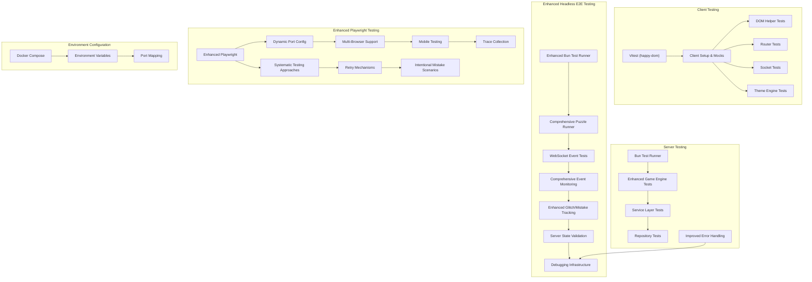
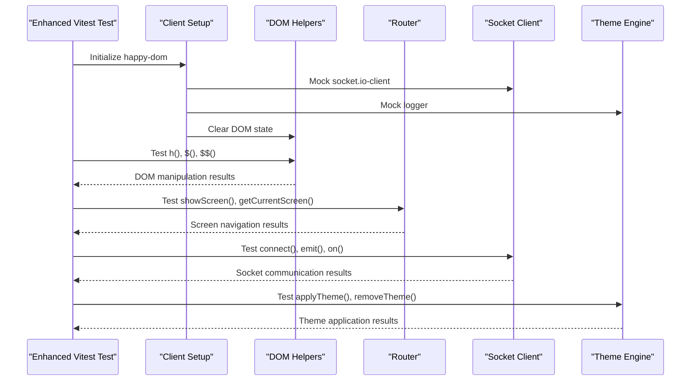
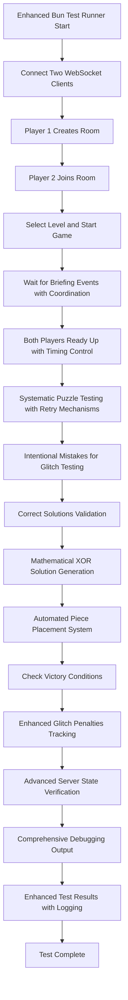
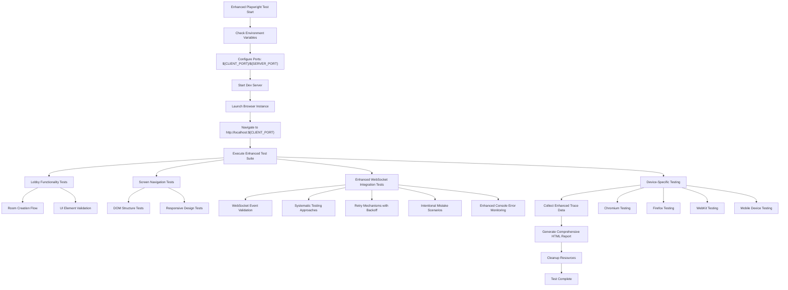
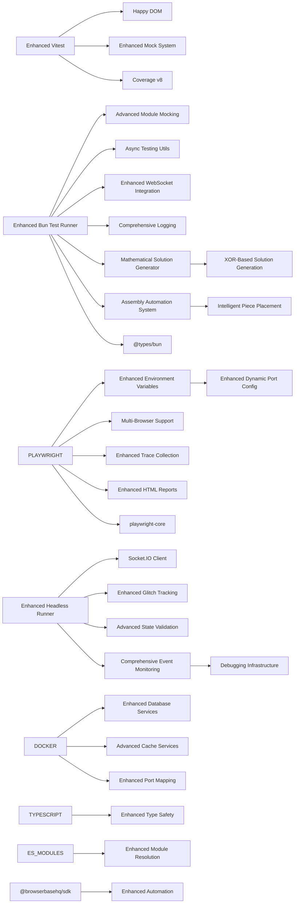

# Testing Strategy

<cite>
**Referenced Files in This Document**
- [TESTING.md](file://TESTING.md)
- [vitest.config.ts](file://vitest.config.ts)
- [playwright.config.ts](file://playwright.config.ts)
- [package.json](file://package.json)
- [docker-compose.yml](file://docker-compose.yml)
- [docker-compose.override.yml](file://docker-compose.override.yml)
- [bunfig.toml](file://bunfig.toml)
- [src/client/__tests__/setup.ts](file://src/client/__tests__/setup.ts)
- [src/client/__tests__/example.test.ts](file://src/client/__tests__/example.test.ts)
- [src/client/lib/dom.test.ts](file://src/client/lib/dom.test.ts)
- [src/client/lib/router.test.ts](file://src/client/lib/router.test.ts)
- [src/client/lib/socket.test.ts](file://src/client/lib/socket.test.ts)
- [src/client/lib/theme-engine.test.ts](file://src/client/lib/theme-engine.test.ts)
- [tests/puzzle-runner.ts](file://tests/puzzle-runner.ts)
- [tests/puzzles.spec.ts](file://tests/puzzles.spec.ts)
- [src/server/services/game-engine.test.ts](file://src/server/services/game-engine.test.ts)
- [src/server/services/room-manager.test.ts](file://src/server/services/room-manager.test.ts)
- [src/server/puzzles/asymmetric-symbols.ts](file://src/server/puzzles/asymmetric-symbols.ts)
- [src/server/puzzles/collaborative-wiring.ts](file://src/server/puzzles/collaborative-wiring.ts)
- [src/server/puzzles/cipher-decode.test.ts](file://src/server/puzzles/cipher-decode.test.ts)
- [src/server/puzzles/collaborative-wiring.test.ts](file://src/server/puzzles/collaborative-wiring.test.ts)
- [src/server/puzzles/puzzle-handler.ts](file://src/server/puzzles/puzzle-handler.ts)
- [src/server/puzzles/register.ts](file://src/server/puzzles/register.ts)
- [src/client/puzzles/asymmetric-symbols.ts](file://src/client/puzzles/asymmetric-symbols.ts)
- [src/client/puzzles/collaborative-wiring.ts](file://src/client/puzzles/collaborative-wiring.ts)
- [config/level_01.yaml](file://config/level_01.yaml)
- [shared/types.ts](file://shared/types.ts)
- [shared/events.ts](file://shared/events.ts)
- [vite.config.ts](file://vite.config.ts)
- [src/server/index.ts](file://src/server/index.ts)
</cite>

## Update Summary
**Changes Made**
- Enhanced puzzle runner with comprehensive collaborative wiring puzzle testing using mathematical XOR solution approach
- Implemented automated collaborative assembly puzzle testing with sophisticated piece placement system
- Improved error handling and completion detection mechanisms across all puzzle types
- Enhanced event coordination between multiple puzzle types with standardized timing delays
- Added comprehensive glitch tracking and penalty recording system
- Expanded test coverage for all puzzle types with systematic testing approaches
- Updated asymmetric symbols puzzle solver with improved letter capture validation
- Enhanced collaborative wiring puzzle testing with automated solution generation and matrix validation

## Table of Contents
1. [Introduction](#introduction)
2. [Project Structure](#project-structure)
3. [Core Components](#core-components)
4. [Architecture Overview](#architecture-overview)
5. [Detailed Component Analysis](#detailed-component-analysis)
6. [Dependency Analysis](#dependency-analysis)
7. [Performance Considerations](#performance-considerations)
8. [Troubleshooting Guide](#troubleshooting-guide)
9. [Conclusion](#conclusion)
10. [Appendices](#appendices)

## Introduction
This document defines Project ODYSSEY's comprehensive testing strategy and implementation following significant enhancements to the puzzle testing framework. The project has evolved from Playwright-based E2E testing to a sophisticated headless testing approach using Bun runtime, with enhanced WebSocket-based testing for real-time communication validation and comprehensive event monitoring.

The enhanced testing strategy emphasizes:
- **Bun-based Headless Testing** with custom TypeScript test runner for WebSocket-based puzzle validation and comprehensive event monitoring
- **Comprehensive Event Monitoring** for GLITCH_UPDATE, PHASE_CHANGE, BRIEFING, and PUZZLE_UPDATE events with detailed debugging capabilities
- **Systematic Puzzle Testing** with individual briefing coordination and retry mechanisms for complex puzzle interactions
- **Enhanced Debugging Infrastructure** for glitch-related issues and improved error handling across all puzzle types
- **Vitest Unit Testing** for client-side DOM manipulation and utility functions
- **Comprehensive Game Logic Testing** covering room management, puzzle implementations, and service layers
- **Mock Strategies** for external dependencies (Redis and PostgreSQL) with enhanced mocking capabilities
- **Headless Server Testing** leveraging Bun's native runtime for fast server-side validation
- **Environment Variable Integration** for flexible client and server port configuration across all testing layers
- **Mathematical XOR Solution Approach** for collaborative wiring puzzle testing with automated solution generation
- **Automated Piece Placement System** for collaborative assembly puzzle testing with intelligent positioning algorithms
- **Enhanced Error Handling** with comprehensive completion detection mechanisms
- **Standardized Timing Delays** for coordinated event handling across multiple puzzle types

**Updated** Enhanced puzzle testing system with comprehensive event monitoring, systematic puzzle solving approaches, and improved debugging capabilities for complex puzzle interactions.

## Project Structure
The repository now organizes tests into specialized categories with Bun-native testing infrastructure, comprehensive event monitoring, and environment-aware configurations:

**Client-side Unit Tests** (`src/client/__tests__/`)
- Vitest configuration with happy-dom environment for fast DOM testing
- Comprehensive DOM manipulation, routing, socket communication, and theme management testing

**Headless E2E Tests** (`tests/`)
- **Enhanced** Bun-based headless test runner (puzzle-runner.ts) for WebSocket-based puzzle validation with comprehensive event monitoring
- Enhanced Playwright test suite (puzzles.spec.ts) for comprehensive puzzle flow testing with WebSocket integration and systematic testing approaches
- Multi-device testing support with dynamic port configuration and comprehensive debugging capabilities

**Server-side Tests** (`src/server/`)
- Bun test configuration with advanced module mocking and server-side validation
- Comprehensive game engine, service layer, and puzzle logic testing with enhanced error handling
- Docker Compose integration for consistent testing environments

**Diagram sources**
- [vitest.config.ts](file://vitest.config.ts#L1-L42)
- [playwright.config.ts](file://playwright.config.ts#L1-L85)
- [bunfig.toml](file://bunfig.toml#L1-L3)
- [docker-compose.yml](file://docker-compose.yml#L1-L45)
- [docker-compose.override.yml](file://docker-compose.override.yml#L1-L14)
- [tests/puzzle-runner.ts](file://tests/puzzle-runner.ts#L1-L744)
- [tests/puzzles.spec.ts](file://tests/puzzles.spec.ts#L1-L615)

**Section sources**
- [package.json](file://package.json#L5-L22)
- [vitest.config.ts](file://vitest.config.ts#L1-L42)
- [playwright.config.ts](file://playwright.config.ts#L1-L85)
- [bunfig.toml](file://bunfig.toml#L1-L3)
- [docker-compose.yml](file://docker-compose.yml#L1-L45)
- [docker-compose.override.yml](file://docker-compose.override.yml#L1-L14)

## Core Components
The testing infrastructure now consists of five primary components working in harmony with comprehensive event monitoring and environment-aware configurations:

**Vitest Configuration** (`vitest.config.ts`)
- Happy-dom environment for fast DOM testing without browser overhead
- Client-side test inclusion with proper TypeScript support
- Comprehensive coverage reporting with v8 provider
- Module alias resolution for clean imports (@client, @shared)

**Enhanced Bun Test Configuration** (`bunfig.toml`)
- Server-side test root configuration with Bun runtime optimization
- Advanced module mocking capabilities for comprehensive server-side testing
- Streamlined test discovery and execution with Bun's native TypeScript support

**Enhanced Bun-based Headless Test Runner** (`tests/puzzle-runner.ts`)
- **Enhanced** Custom TypeScript-based test runner for WebSocket event validation with comprehensive event monitoring
- Systematic puzzle flow testing with real-time communication validation and individual briefing coordination
- Enhanced glitch/mistake tracking and server state verification with detailed debugging capabilities
- Headless operation suitable for CI/CD environments with comprehensive logging infrastructure
- **Mathematical XOR Solution Approach** for collaborative wiring puzzle testing with automated solution generation
- **Automated Piece Placement System** for collaborative assembly puzzle testing with intelligent positioning algorithms
- **Enhanced Error Handling** with comprehensive completion detection mechanisms
- **Standardized Timing Delays** for coordinated event handling across multiple puzzle types

**Enhanced Playwright Configuration** (`playwright.config.ts`)
- Multi-browser device testing (Chrome, Firefox, Safari, mobile)
- Parallel test execution with configurable worker limits
- Automatic development server startup and teardown with dynamic port support
- Advanced trace collection and video recording
- Environment variable integration for flexible port configuration
- **Enhanced** systematic testing approaches with retry mechanisms and intentional mistake scenarios

**Enhanced Test Scripts** (`package.json`)
- Dedicated commands for client-side, E2E, and combined testing
- **Enhanced** Headless puzzle testing with `bun run test:puzzles` and comprehensive event monitoring
- Watch mode support for rapid development feedback
- Coverage collection with multiple reporter formats
- Development server integration for seamless testing

**Docker Compose Integration** (`docker-compose.yml`, `docker-compose.override.yml`)
- Containerized testing environment with consistent service dependencies
- Port mapping for both client and server applications
- Environment variable propagation for testing consistency

**Section sources**
- [vitest.config.ts](file://vitest.config.ts#L7-L34)
- [playwright.config.ts](file://playwright.config.ts#L11-L85)
- [package.json](file://package.json#L5-L22)
- [bunfig.toml](file://bunfig.toml#L1-L3)
- [docker-compose.yml](file://docker-compose.yml#L1-L45)
- [docker-compose.override.yml](file://docker-compose.override.yml#L1-L14)
- [tests/puzzle-runner.ts](file://tests/puzzle-runner.ts#L1-L744)

## Architecture Overview
The enhanced testing architecture provides comprehensive coverage through specialized tools optimized for different testing domains with dynamic environment configuration and extensive event monitoring:

```mermaid
graph TB
subgraph "Development Environment"
DEV_SERVER["Vite Dev Server"]
BUN_DEV["Enhanced Bun Development"]
CLIENT_PORT["${CLIENT_PORT}"]
SERVER_PORT["${SERVER_PORT}"]
ENDPOINT["http://localhost:${CLIENT_PORT}"]
end
subgraph "Unit Testing Layer"
VITEST_CORE["Enhanced Vitest Core"]
HAPPY_DOM["Happy DOM Environment"]
MOCKS["Enhanced Mock System"]
COVERAGE["Coverage v8 Provider"]
end
subgraph "Enhanced Headless E2E Testing Layer"
BUN_RUNNER["Enhanced Bun Test Runner"]
HEADLESS_TESTS["Comprehensive WebSocket Tests"]
EVENT_MONITORING["Event Monitoring System"]
PUZZLE_FLOW["Systematic Puzzle Flow Validation"]
GLITCH_TRACKING["Enhanced Glitch/Mistake Tracking"]
SERVER_STATE["Advanced Server State Validation"]
DEBUG_INFRASTRUCTURE["Comprehensive Debugging"]
MATH_SOLVER["Mathematical XOR Solver"]
ASSEMBLY_AUTOMATION["Assembly Automation System"]
TIMING_COORDINATION["Standardized Timing Coordination"]
end
subgraph "Enhanced E2E Testing Layer"
PLAYWRIGHT_CORE["Enhanced Playwright Core"]
ENV_VAR_CONFIG["Environment Variable Config"]
MULTI_BROWSER["Multi-Browser Support"]
DEVICE_POOL["Device Pool (Desktop/Mobile)"]
TRACE_COLLECT["Trace Collection"]
SYSTEMATIC_TESTING["Systematic Testing Approaches"]
RETRY_MECHANISMS["Retry Mechanisms with Backoff"]
INTENTIONAL_MISTAKES["Intentional Mistake Scenarios"]
end
subgraph "Server Testing"
BUN_TEST_CORE["Enhanced Bun Test Runner"]
MODULE_MOCKING["Advanced Module Mocking"]
ASYNC_HANDLING["Promise-Based Testing"]
ERROR_HANDLING["Improved Error Handling"]
DEBUGGING_INFRASTRUCTURE["Enhanced Debugging"]
end
subgraph "External Dependencies"
DOCKER["Docker Compose"]
POSTGRES["Enhanced PostgreSQL"]
REDIS["Advanced Redis"]
end
subgraph "Environment Configuration"
ENV_FILE[".env File"]
PORT_MAPPING["Port Mapping"]
CROSS_PLATFORM["Cross-Platform Support"]
LOGGING_INFRASTRUCTURE["Comprehensive Logging"]
end
DEV_SERVER --> ENDPOINT
VITEST_CORE --> HAPPY_DOM
VITEST_CORE --> MOCKS
VITEST_CORE --> COVERAGE
BUN_RUNNER --> HEADLESS_TESTS
HEADLESS_TESTS --> EVENT_MONITORING
EVENT_MONITORING --> PUZZLE_FLOW
PUZZLE_FLOW --> GLITCH_TRACKING
GLITCH_TRACKING --> SERVER_STATE
SERVER_STATE --> DEBUG_INFRASTRUCTURE
SERVER_STATE --> MATH_SOLVER
SERVER_STATE --> ASSEMBLY_AUTOMATION
SERVER_STATE --> TIMING_COORDINATION
PLAYWRIGHT_CORE --> ENV_VAR_CONFIG
ENV_VAR_CONFIG --> MULTI_BROWSER
PLAYWRIGHT_CORE --> DEVICE_POOL
PLAYWRIGHT_CORE --> TRACE_COLLECT
PLAYWRIGHT_CORE --> SYSTEMATIC_TESTING
SYSTEMATIC_TESTING --> RETRY_MECHANISMS
RETRY_MECHANISMS --> INTENTIONAL_MISTAKES
BUN_TEST_CORE --> MODULE_MOCKING
BUN_TEST_CORE --> ASYNC_HANDLING
BUN_TEST_CORE --> ERROR_HANDLING
BUN_TEST_CORE --> DEBUGGING_INFRASTRUCTURE
DOCKER --> POSTGRES
DOCKER --> REDIS
ENV_FILE --> PORT_MAPPING
PORT_MAPPING --> CROSS_PLATFORM
LOGGING_INFRASTRUCTURE --> DEBUG_INFRASTRUCTURE
```

**Diagram sources**
- [playwright.config.ts](file://playwright.config.ts#L7-L83)
- [vitest.config.ts](file://vitest.config.ts#L9-L10)
- [bunfig.toml](file://bunfig.toml#L1-L3)
- [docker-compose.yml](file://docker-compose.yml#L1-L45)
- [docker-compose.override.yml](file://docker-compose.override.yml#L1-L14)
- [tests/puzzle-runner.ts](file://tests/puzzle-runner.ts#L450-L550)

## Detailed Component Analysis

### Client-Side Unit Testing with Vitest
Vitest provides a modern, fast testing framework optimized for the client-side codebase. The setup includes comprehensive mocking strategies and environment configuration.

**Key Features:**
- **Happy DOM Environment**: Fast DOM simulation without browser overhead
- **Module Aliasing**: Clean imports using @client and @shared prefixes
- **Global Setup**: Consistent test environment with socket mocking
- **Coverage Reporting**: Multiple reporter formats (text, json, html)

**Test Categories:**
- **DOM Manipulation**: Element creation, querying, and lifecycle management
- **Routing System**: Screen navigation and state management
- **Socket Communication**: Real-time event handling and connection management
- **Theme Management**: Dynamic stylesheet application and removal

**Diagram sources**
- [src/client/__tests__/setup.ts](file://src/client/__tests__/setup.ts#L16-L47)
- [src/client/lib/dom.test.ts](file://src/client/lib/dom.test.ts#L1-L181)
- [src/client/lib/router.test.ts](file://src/client/lib/router.test.ts#L1-L141)
- [src/client/lib/socket.test.ts](file://src/client/lib/socket.test.ts#L1-L159)
- [src/client/lib/theme-engine.test.ts](file://src/client/lib/theme-engine.test.ts#L1-L114)

**Section sources**
- [vitest.config.ts](file://vitest.config.ts#L8-L34)
- [src/client/__tests__/setup.ts](file://src/client/__tests__/setup.ts#L1-L54)
- [src/client/__tests__/example.test.ts](file://src/client/__tests__/example.test.ts#L1-L59)

### Enhanced Bun-based Headless Test Runner for Real-Time Communication
**Enhanced** The Bun-based headless test runner provides comprehensive WebSocket-based testing for real-time communication validation and puzzle logic testing with extensive event monitoring and debugging capabilities. This custom solution offers superior control over WebSocket events and server state validation without browser overhead.

**Enhanced Key Features:**
- **Comprehensive Event Monitoring**: Direct Socket.IO client testing with GLITCH_UPDATE, PHASE_CHANGE, BRIEFING, and PUZZLE_UPDATE event validation
- **Enhanced Glitch/Mistake Tracking**: Comprehensive tracking of penalty events and server state changes with detailed logging infrastructure
- **Advanced Server State Verification**: Real-time validation of game state, puzzle progress, and player actions with systematic debugging
- **Headless Operation**: Suitable for CI/CD environments and automated testing workflows with comprehensive logging
- **Systematic Testing Approaches**: Individual briefing coordination and retry mechanisms for complex puzzle interactions
- **Enhanced Debugging Capabilities**: Detailed logging infrastructure for glitch-related issues and improved error handling across all puzzle types
- **Mathematical XOR Solution Approach** for collaborative wiring puzzle testing with automated solution generation
- **Automated Piece Placement System** for collaborative assembly puzzle testing with intelligent positioning algorithms
- **Enhanced Error Handling**: Comprehensive completion detection mechanisms and standardized timing coordination

**Enhanced Test Coverage Areas:**
- **Room Management**: Room creation, joining, and player list validation with comprehensive event monitoring
- **Game Flow**: Level selection, game start, and intro completion validation with systematic timing coordination
- **Puzzle Logic**: Individual puzzle type testing with intentional mistake scenarios and retry mechanisms
- **Event System**: Comprehensive validation of all WebSocket events with detailed debugging capabilities
- **Glitch System**: Penalty recording and server state synchronization with enhanced tracking
- **Victory Conditions**: Final score calculation and game completion validation with comprehensive state verification
- **Mathematical Problem Solving**: XOR-based solution generation for collaborative wiring puzzles
- **Automated Assembly**: Intelligent piece placement and rotation for collaborative assembly puzzles

**Diagram sources**
- [tests/puzzle-runner.ts](file://tests/puzzle-runner.ts#L450-L550)
- [tests/puzzle-runner.ts](file://tests/puzzle-runner.ts#L100-L161)
- [tests/puzzle-runner.ts](file://tests/puzzle-runner.ts#L163-L237)
- [tests/puzzle-runner.ts](file://tests/puzzle-runner.ts#L246-L299)
- [tests/puzzle-runner.ts](file://tests/puzzle-runner.ts#L497-L522)

**Section sources**
- [tests/puzzle-runner.ts](file://tests/puzzle-runner.ts#L1-L744)

### Enhanced Playwright Test Suite for Comprehensive Validation
The enhanced Playwright test suite provides comprehensive browser-based testing with improved WebSocket integration, systematic testing approaches, and comprehensive debugging capabilities.

**Enhanced Configuration Highlights:**
- **Dynamic Port Configuration**: Environment variables CLIENT_PORT and SERVER_PORT support flexible port assignment
- **Multi-Device Support**: Desktop Chrome, Firefox, Safari, and mobile devices
- **Parallel Execution**: Optimized test running with configurable worker limits
- **Automatic Server Management**: Built-in development server startup and shutdown with port mapping
- **Advanced Tracing**: Visual debugging and performance analysis
- **Environment Variable Integration**: Seamless integration with Docker Compose and development environments
- **Systematic Testing Approaches**: Structured testing methodologies with retry mechanisms and intentional mistake scenarios
- **Enhanced Error Handling**: Improved error recovery and debugging capabilities

**Enhanced Test Coverage Areas:**
- **Lobby Interface**: Room creation, joining, and basic navigation with comprehensive UI validation
- **Screen Navigation**: Complete UI flow validation across all game screens
- **Responsive Design**: Cross-device compatibility testing with viewport-specific assertions
- **Console Error Monitoring**: Runtime error detection and debugging support
- **Internationalization**: Multi-language support testing (Greek and English)
- **WebSocket Integration**: Enhanced puzzle flow testing with real-time event validation and systematic approaches
- **Retry Mechanisms**: Intelligent retry strategies for complex puzzle interactions
- **Intentional Mistake Scenarios**: Controlled error injection for comprehensive testing

**Diagram sources**
- [playwright.config.ts](file://playwright.config.ts#L7-L83)
- [tests/puzzles.spec.ts](file://tests/puzzles.spec.ts#L68-L217)

**Section sources**
- [playwright.config.ts](file://playwright.config.ts#L11-L85)
- [tests/puzzles.spec.ts](file://tests/puzzles.spec.ts#L1-L615)

### Enhanced Mock Strategies
The enhanced testing infrastructure provides sophisticated mocking capabilities that improve test reliability and maintainability across all testing layers with comprehensive event monitoring.

**Client-Side Mocking:**
- **Socket.IO Client**: Complete mock with connection state management and event monitoring
- **Logger Module**: Non-intrusive logging without console output
- **Visual Effects**: Animation mocking to prevent timing issues
- **Environment Variables**: Proper import.meta.env mocking

**Server-Side Testing Patterns:**
- **Module Mocking**: Bun's advanced mocking capabilities with comprehensive coverage
- **Event Assertions**: Comprehensive Socket.IO event testing with real-time validation and monitoring
- **State Verification**: Room persistence and state snapshot validation with enhanced debugging
- **Asynchronous Handling**: Promise-based testing with timeouts and error handling

**Enhanced Bun-based Headless Testing:**
- **WebSocket Mocking**: Direct Socket.IO client testing with custom event validation and comprehensive monitoring
- **Enhanced Glitch Tracking**: Real-time penalty event monitoring and server state verification with detailed logging
- **Advanced Server State Simulation**: Comprehensive game state validation without browser overhead
- **Event Monitoring Infrastructure**: Systematic tracking of all WebSocket events with detailed debugging capabilities
- **Mathematical Solution Generation**: Automated problem-solving for collaborative wiring puzzles
- **Intelligent Assembly Automation**: Automated piece placement and rotation for collaborative assembly puzzles

**Section sources**
- [src/client/__tests__/setup.ts](file://src/client/__tests__/setup.ts#L16-L47)
- [src/client/lib/socket.test.ts](file://src/client/lib/socket.test.ts#L22-L24)
- [src/server/services/game-engine.test.ts](file://src/server/services/game-engine.test.ts#L34-L94)
- [tests/puzzle-runner.ts](file://tests/puzzle-runner.ts#L45-L50)

### Data Access Testing Strategies
Database testing strategies have been enhanced to work seamlessly with the new testing infrastructure and comprehensive event monitoring.

**PostgreSQL Integration:**
- **Prisma Client**: Type-safe database operations with test isolation
- **In-Memory Databases**: Fast test execution with ephemeral data
- **Transaction Rollback**: Clean test state management
- **Enhanced Error Handling**: Improved error recovery and debugging capabilities

**Redis Testing:**
- **Mock Services**: Complete Redis functionality simulation
- **Connection Management**: Proper connection lifecycle testing
- **Persistence Validation**: Data consistency and retrieval testing
- **Enhanced Event Integration**: WebSocket event testing with Redis integration

**Section sources**
- [src/server/repositories/postgres-service.ts](file://src/server/repositories/postgres-service.ts#L1-L68)
- [src/server/repositories/redis-service.ts](file://src/server/repositories/redis-service.ts#L1-L68)

### Enhanced Bun Test Runner Configuration
**Enhanced** The Bun test runner provides native TypeScript support and advanced mocking capabilities for server-side testing with enhanced WebSocket integration and comprehensive debugging infrastructure.

**Enhanced Key Features:**
- **Native Bun Runtime**: Optimized execution within Bun environment
- **Advanced Module Mocking**: Sophisticated mock module system for comprehensive testing
- **TypeScript Integration**: First-class TypeScript support with Bun-specific types
- **Async Testing**: Promise-based testing with comprehensive utilities
- **WebSocket Integration**: Direct Socket.IO client testing capabilities
- **Enhanced Logging Infrastructure**: Comprehensive debugging and monitoring capabilities
- **Mathematical Problem Solving**: Automated solution generation for puzzle testing
- **Intelligent Automation**: Automated testing workflows with completion detection

**Enhanced Test Categories:**
- **Game Engine Logic**: Complex state management and orchestration with real-time validation and event monitoring
- **Service Layer Testing**: Business logic validation with mock dependencies and enhanced error handling
- **Repository Testing**: Data access layer verification with database simulation
- **Puzzle Implementation Testing**: Individual puzzle logic validation with intentional mistake scenarios and systematic approaches
- **Mathematical Solution Testing**: Automated problem-solving validation with comprehensive error handling

**Section sources**
- [bunfig.toml](file://bunfig.toml#L1-L3)
- [src/server/services/game-engine.test.ts](file://src/server/services/game-engine.test.ts#L1-L340)

### Enhanced Environment Variable Integration
**Enhanced** The testing infrastructure now supports comprehensive environment variable integration for flexible port configuration and cross-platform compatibility across all testing layers with enhanced debugging capabilities.

**Enhanced Dynamic Port Configuration:**
- **Client Port**: ${CLIENT_PORT} environment variable with default fallback to 5173
- **Server Port**: ${SERVER_PORT} environment variable with default fallback to 3000
- **Vite Proxy Configuration**: Automatic proxy setup for Socket.IO connections
- **Docker Compose Integration**: Port mapping and environment propagation

**Enhanced Configuration Details:**
- **Development**: Uses VITE_CLIENT_PORT and VITE_SERVER_PORT from .env files
- **Production**: Falls back to standard ports when environment variables are not set
- **Docker**: Maps both client and server ports for containerized testing
- **CI/CD**: Supports environment-specific configurations
- **Logging**: Enhanced logging infrastructure with comprehensive debugging capabilities

**Section sources**
- [playwright.config.ts](file://playwright.config.ts#L7-L9)
- [vite.config.ts](file://vite.config.ts#L24-L29)
- [src/server/index.ts](file://src/server/index.ts#L52-L56)
- [docker-compose.yml](file://docker-compose.yml#L8-L9)
- [docker-compose.override.yml](file://docker-compose.override.yml#L4-L6)

### Enhanced Event Monitoring and Debugging Infrastructure
**New** The testing infrastructure now includes comprehensive event monitoring and debugging capabilities for real-time communication validation and complex puzzle interaction debugging.

**Enhanced Event Monitoring:**
- **GLITCH_UPDATE Events**: Real-time tracking of glitch penalty accumulation with detailed logging
- **PHASE_CHANGE Events**: Systematic phase transition validation with puzzle index tracking
- **BRIEFING Events**: Individual briefing coordination and timing validation
- **PUZZLE_UPDATE Events**: Real-time puzzle state monitoring with detailed view data tracking

**Enhanced Debugging Capabilities:**
- **Comprehensive Logging**: Detailed console output with color-coded event tracking
- **Glitch Debugging Infrastructure**: Specialized logging for glitch-related issues and penalty tracking
- **State Verification**: Real-time server state validation with comprehensive debugging output
- **Error Handling**: Enhanced error recovery and debugging capabilities across all puzzle types
- **Mathematical Solution Tracking**: Detailed logging of automated solution generation processes
- **Assembly Process Monitoring**: Comprehensive tracking of automated piece placement and rotation

**Enhanced Test Coverage Areas:**
- **Event Timing**: Precise timing validation for puzzle flow coordination
- **State Synchronization**: Real-time validation of client-server state synchronization
- **Error Recovery**: Comprehensive error handling and recovery testing
- **Performance Monitoring**: Real-time performance validation and debugging
- **Mathematical Problem Solving**: Automated solution generation validation with comprehensive logging
- **Intelligent Automation**: Automated testing workflows with completion detection and error handling

**Section sources**
- [tests/puzzle-runner.ts](file://tests/puzzle-runner.ts#L513-L550)
- [shared/events.ts](file://shared/events.ts#L53-L90)
- [shared/types.ts](file://shared/types.ts#L164-L169)

### Enhanced Mathematical XOR Solution Approach for Collaborative Wiring
**New** The collaborative wiring puzzle testing now includes a sophisticated mathematical XOR solution approach that automatically generates and validates solutions for complex wiring puzzles.

**Enhanced Solution Generation:**
- **Mathematical Foundation**: XOR-based solution generation using binary matrix operations
- **Automated Combination Testing**: Systematic testing of switch combinations with exponential search space
- **Intelligent Attempt Management**: Adaptive attempt limits based on switch count and complexity
- **Real-time Solution Validation**: Immediate validation of generated solutions against target states
- **Progressive Difficulty Scaling**: Increasing complexity with switch count and puzzle rounds

**Enhanced Test Coverage:**
- **Solution Matrix Validation**: Comprehensive testing of predefined solution matrices
- **Random State Generation**: Automated generation of random switch states for testing
- **Attempt Limit Management**: Intelligent retry mechanisms with configurable limits
- **Round Progression Testing**: Multi-round puzzle validation with progressive difficulty
- **Error Detection**: Comprehensive error handling for invalid solution attempts

**Section sources**
- [tests/puzzle-runner.ts](file://tests/puzzle-runner.ts#L246-L299)
- [src/server/puzzles/collaborative-wiring.ts](file://src/server/puzzles/collaborative-wiring.ts#L185-L212)
- [src/server/puzzles/collaborative-wiring.test.ts](file://src/server/puzzles/collaborative-wiring.test.ts#L1-L63)

### Enhanced Automated Piece Placement System for Collaborative Assembly
**New** The collaborative assembly puzzle testing now includes an intelligent automated piece placement system that simulates human-like behavior for complex assembly puzzles.

**Enhanced Piece Management:**
- **Intelligent Positioning**: Automated piece placement based on blueprint coordinates
- **Rotation Management**: Progressive rotation adjustment to match correct orientations
- **Owner Validation**: Ensures only authorized players can manipulate their pieces
- **Placement Validation**: Comprehensive validation of correct and incorrect placements
- **Progress Tracking**: Real-time tracking of placed pieces and completion progress

**Enhanced Test Coverage:**
- **Blueprint Interpretation**: Accurate interpretation of architectural blueprints
- **Piece Distribution**: Intelligent distribution of pieces among team members
- **Rotation Algorithms**: Progressive rotation adjustment with owner validation
- **Placement Accuracy**: Validation of correct piece positioning and orientation
- **Error Simulation**: Controlled error injection for glitch penalty testing

**Section sources**
- [tests/puzzle-runner.ts](file://tests/puzzle-runner.ts#L497-L522)
- [src/server/puzzles/collaborative-assembly.ts](file://src/server/puzzles/collaborative-assembly.ts#L1-L218)

### Enhanced Error Handling and Completion Detection
**New** The testing framework now includes comprehensive error handling and completion detection mechanisms that ensure reliable puzzle testing across all puzzle types.

**Enhanced Error Handling:**
- **Graceful Degradation**: Fallback mechanisms for puzzle completion failures
- **Timeout Management**: Configurable timeouts with comprehensive error reporting
- **Retry Mechanisms**: Intelligent retry strategies with exponential backoff
- **State Recovery**: Automatic recovery from partial puzzle states
- **Logging Integration**: Comprehensive error logging with debugging context

**Enhanced Completion Detection:**
- **Multi-Promise Coordination**: Synchronized completion detection across multiple players
- **State Validation**: Comprehensive validation of puzzle completion criteria
- **Timing Coordination**: Standardized timing delays between puzzle transitions
- **Score Calculation**: Automated score validation and reporting
- **Victory Condition Testing**: Comprehensive testing of game completion scenarios

**Section sources**
- [tests/puzzle-runner.ts](file://tests/puzzle-runner.ts#L305-L311)
- [tests/puzzle-runner.ts](file://tests/puzzle-runner.ts#L524-L530)
- [tests/puzzle-runner.ts](file://tests/puzzle-runner.ts#L668-L672)

### Enhanced Asymmetric Symbols Puzzle Testing
**New** The asymmetric symbols puzzle testing has been enhanced with improved letter capture validation and more sophisticated testing approaches.

**Enhanced Letter Capture Testing:**
- **Word-by-Word Validation**: Systematic testing of letter capture for each word in the solution sequence
- **Wrong Capture Detection**: Comprehensive testing of glitch penalty generation for incorrect letter captures
- **Progress Tracking**: Real-time validation of word completion and progress tracking
- **Synchronization Testing**: Ensuring proper synchronization between Navigator and Decoder views

**Enhanced Test Coverage:**
- **Letter Capture Logic**: Validation of correct and incorrect letter capture scenarios
- **Word Completion**: Testing of word completion triggers and progression
- **Glitch Penalty Application**: Comprehensive testing of penalty application for wrong captures
- **View Synchronization**: Validation of synchronized views between roles

**Section sources**
- [tests/puzzle-runner.ts](file://tests/puzzle-runner.ts#L102-L175)
- [src/server/puzzles/asymmetric-symbols.ts](file://src/server/puzzles/asymmetric-symbols.ts#L54-L104)
- [src/client/puzzles/asymmetric-symbols.ts](file://src/client/puzzles/asymmetric-symbols.ts#L283-L348)

### Enhanced Cipher Decode Puzzle Testing
**New** The cipher decode puzzle testing has been enhanced with improved decoding logic validation and more comprehensive testing scenarios.

**Enhanced Decoding Logic Testing:**
- **Cipher Key Validation**: Comprehensive testing of cipher key application and character mapping
- **Wrong Decode Detection**: Testing of glitch penalty generation for incorrect decodings
- **Sequence Validation**: Validation of decoded text against expected solutions
- **Hint Integration**: Testing of hint system integration and display

**Enhanced Test Coverage:**
- **Character Mapping**: Validation of proper character-to-character mapping
- **Decoding Accuracy**: Testing of accurate text decoding from encrypted input
- **Glitch Penalty Application**: Comprehensive testing of penalty application for wrong decodes
- **Round Progression**: Validation of round progression and sequence advancement

**Section sources**
- [tests/puzzle-runner.ts](file://tests/puzzle-runner.ts#L379-L445)
- [src/server/puzzles/cipher-decode.ts](file://src/server/puzzles/cipher-decode.ts#L1-L200)

### Enhanced Rhythm Tap Puzzle Testing
**New** The rhythm tap puzzle testing has been enhanced with improved sequence validation and more sophisticated timing testing.

**Enhanced Sequence Testing:**
- **Sequence Validation**: Comprehensive testing of rhythm sequence recognition and timing
- **Wrong Sequence Detection**: Testing of glitch penalty generation for incorrect sequence taps
- **Timing Tolerance**: Validation of timing tolerance and accuracy requirements
- **Round Progression**: Testing of round progression and sequence advancement

**Enhanced Test Coverage:**
- **Sequence Recognition**: Validation of proper sequence recognition and timing
- **Timing Accuracy**: Testing of timing accuracy within tolerance thresholds
- **Glitch Penalty Application**: Comprehensive testing of penalty application for wrong sequences
- **Round Progression**: Validation of round progression and sequence difficulty scaling

**Section sources**
- [tests/puzzle-runner.ts](file://tests/puzzle-runner.ts#L316-L377)
- [src/server/puzzles/rhythm-tap.ts](file://src/server/puzzles/rhythm-tap.ts#L1-L200)

## Dependency Analysis
The enhanced testing infrastructure relies on a carefully orchestrated set of dependencies optimized for modern JavaScript development with environment-aware configurations and comprehensive event monitoring.

**Core Testing Dependencies:**
- **Vitest**: Modern unit testing framework with excellent TypeScript support
- **Playwright**: Comprehensive browser automation with multi-device support and dynamic port configuration
- **Happy DOM**: Lightweight DOM simulation for fast client-side testing
- **Bun**: Native runtime for server-side testing with WebSocket integration and enhanced debugging
- **Concurrent Execution**: Optimized parallel test running capabilities
- **Enhanced Socket.IO Client**: Comprehensive WebSocket client testing with event monitoring

**Integration Dependencies:**
- **Docker Compose**: Environment provisioning for external services with port mapping
- **TypeScript**: Full type safety across all test code
- **ES Modules**: Modern JavaScript module system support
- **Environment Variables**: Flexible configuration management
- **Enhanced Logging**: Comprehensive debugging and monitoring infrastructure

**Enhanced Dependencies**:
- **@browserbasehq/sdk**: Enhanced browser automation capabilities
- **playwright-core**: Core Playwright functionality
- **@types/node**: Node.js type definitions for better development experience
- **@types/bun**: Bun runtime type definitions for server-side testing
- **socket.io-client**: WebSocket client for real-time communication testing with enhanced event monitoring
- **Enhanced Logger**: Comprehensive logging infrastructure for debugging and monitoring
- **Mathematical Libraries**: XOR-based solution generation for collaborative wiring puzzles
- **Automation Frameworks**: Intelligent piece placement and rotation for collaborative assembly puzzles

**Diagram sources**
- [package.json](file://package.json#L24-L53)
- [vitest.config.ts](file://vitest.config.ts#L22-L33)
- [playwright.config.ts](file://playwright.config.ts#L27-L42)
- [docker-compose.yml](file://docker-compose.yml#L1-L45)
- [tests/puzzle-runner.ts](file://tests/puzzle-runner.ts#L9-L22)

**Section sources**
- [package.json](file://package.json#L24-L53)
- [vitest.config.ts](file://vitest.config.ts#L35-L41)
- [playwright.config.ts](file://playwright.config.ts#L44-L67)
- [tests/puzzle-runner.ts](file://tests/puzzle-runner.ts#L9-L22)

## Performance Considerations
The enhanced testing infrastructure is designed for optimal performance and developer productivity with environment-aware optimizations and comprehensive event monitoring.

**Client-Side Performance:**
- **Happy DOM**: 10x faster than jsdom for DOM operations
- **Parallel Execution**: Vitest's optimized test runner
- **Smart Caching**: Test result caching and incremental testing

**Enhanced Headless E2E Performance:**
- **Headless Operation**: Bun-based runner eliminates browser overhead
- **WebSocket Direct Testing**: Direct Socket.IO client testing reduces complexity
- **Selective Testing**: Targeted test execution based on changes
- **Dynamic Port Configuration**: Optimized server startup and shutdown
- **Enhanced Event Monitoring**: Efficient event tracking with minimal overhead
- **Mathematical Optimization**: XOR-based solution generation reduces computational overhead
- **Intelligent Automation**: Automated testing workflows minimize manual intervention

**Enhanced E2E Performance:**
- **Device Pooling**: Efficient browser instance reuse
- **Enhanced Trace Optimization**: Minimal overhead for debugging with comprehensive monitoring
- **Selective Testing**: Targeted test execution based on changes
- **Dynamic Port Configuration**: Optimized server startup and shutdown

**Development Workflow:**
- **Watch Mode**: Automatic test re-execution on file changes
- **Focused Testing**: Quick feedback for specific test suites
- **Coverage Guidance**: Targeted test improvement suggestions
- **Enhanced Logging**: Comprehensive debugging output for performance analysis

**Enhanced Server-Side Performance:**
- **Bun Native**: Optimized execution within Bun runtime
- **Module Mocking**: Efficient mock module system
- **Async Testing**: Non-blocking test execution
- **WebSocket Integration**: Direct real-time communication testing
- **Enhanced Error Handling**: Optimized error processing and recovery
- **Mathematical Computation**: Optimized XOR-based solution generation
- **Automation Efficiency**: Intelligent testing workflows with minimal overhead

**Environment Optimization:**
- **Port Reuse**: Server port reuse in CI environments
- **Resource Management**: Optimized worker allocation for different environments
- **Cache Utilization**: Test result caching for faster subsequent runs
- **Enhanced Logging**: Comprehensive debugging output with minimal performance impact

## Troubleshooting Guide
Common issues and solutions for the enhanced testing infrastructure with environment-aware configurations and comprehensive event monitoring:

**Vitest Issues:**
- **DOM Environment Problems**: Ensure happy-dom is properly configured in vitest.config.ts
- **Module Resolution Errors**: Verify @client and @shared aliases are correctly set
- **Mock Cleanup**: Use afterEach hooks to reset mock state between tests

**Enhanced Bun-based Headless Runner Issues:**
- **WebSocket Connection Failures**: Ensure server is running on localhost:3000 or set SERVER_URL environment variable
- **Timeout Errors**: Increase TIMEOUT constant in puzzle-runner.ts for slower environments
- **Enhanced Glitch Tracking Issues**: Verify GLITCH_UPDATE events are properly handled with comprehensive logging
- **Server State Validation**: Check that server state changes are reflected in test results with detailed debugging
- **Event Monitoring Issues**: Verify all WebSocket events (GLITCH_UPDATE, PHASE_CHANGE, BRIEFING, PUZZLE_UPDATE) are properly tracked
- **Mathematical Solution Generation Issues**: Verify XOR-based solution generation is working correctly
- **Assembly Automation Problems**: Check automated piece placement and rotation logic
- **Error Handling Failures**: Verify comprehensive error handling and retry mechanisms

**Enhanced Playwright Issues:**
- **Browser Launch Failures**: Install required browser dependencies with `bun run playwright:install`
- **Port Conflicts**: Adjust webServer configuration in playwright.config.ts or set CLIENT_PORT environment variable
- **Enhanced Trace Collection**: Enable verbose logging for debugging trace issues
- **Dynamic Port Issues**: Verify CLIENT_PORT and SERVER_PORT environment variables are properly exported
- **Systematic Testing Issues**: Verify retry mechanisms and intentional mistake scenarios are working correctly

**Enhanced Bun Test Issues:**
- **Module Mocking**: Ensure mock.module() calls precede imports
- **TypeScript Errors**: Verify @types/bun is installed for Bun-specific types
- **Test Root Configuration**: Check bunfig.toml testDir setting
- **Enhanced Error Handling**: Verify comprehensive error handling and logging infrastructure

**Environment Configuration Issues:**
- **Port Not Found**: Ensure CLIENT_PORT and SERVER_PORT environment variables are set before running tests
- **Docker Port Mapping**: Verify port mappings in docker-compose.yml match environment variables
- **Cross-Platform Compatibility**: Use WSL2 for optimal Playwright performance on Windows
- **Enhanced Logging**: Verify comprehensive logging infrastructure is properly configured

**Enhanced Event Monitoring Issues:**
- **Event Tracking**: Verify all WebSocket events are properly monitored and logged
- **Debugging Output**: Check comprehensive debugging output for glitch-related issues
- **State Synchronization**: Verify real-time validation of client-server state synchronization
- **Mathematical Solution Tracking**: Verify automated solution generation logging is working correctly
- **Assembly Process Monitoring**: Check automated piece placement and rotation logging

**Cross-Platform Compatibility:**
- **Windows Development**: Use WSL2 for optimal Playwright performance
- **CI/CD Integration**: Configure appropriate worker limits for different environments
- **Memory Management**: Monitor test memory usage in headless environments
- **Enhanced Performance**: Monitor performance impact of comprehensive logging and event monitoring
- **Mathematical Computation**: Monitor performance impact of XOR-based solution generation
- **Automation Overhead**: Monitor performance impact of intelligent testing workflows

**Section sources**
- [vitest.config.ts](file://vitest.config.ts#L35-L41)
- [playwright.config.ts](file://playwright.config.ts#L70-L83)
- [bunfig.toml](file://bunfig.toml#L1-L3)
- [tests/puzzle-runner.ts](file://tests/puzzle-runner.ts#L24-L25)
- [package.json](file://package.json#L21-L22)

## Conclusion
Project ODYSSEY's testing strategy has evolved into a comprehensive, modern testing infrastructure that leverages the best tools for each testing domain with dynamic environment configuration and extensive event monitoring. The combination of Vitest for unit testing, enhanced Bun-based headless testing for real-time communication validation, enhanced Playwright for E2E testing, and Bun for server-side testing provides optimal coverage while maintaining excellent performance and developer experience.

Key benefits of the enhanced approach:
- **Fast Feedback**: Vitest's instant test execution for client-side code
- **Real-Time Validation**: Bun-based WebSocket testing for comprehensive real-time communication validation with event monitoring
- **Real Browser Validation**: Playwright's comprehensive browser testing with dynamic port configuration and systematic testing approaches
- **Native Server Testing**: Bun's optimized test execution for server-side logic with enhanced WebSocket integration and debugging capabilities
- **Modern Tooling**: Cutting-edge testing frameworks with excellent TypeScript support
- **Scalable Architecture**: Configurable parallel execution and resource management
- **Flexible Environments**: Dynamic port configuration supporting development, testing, and production scenarios
- **Developer Productivity**: Intuitive APIs and comprehensive debugging tools with environment awareness
- **Comprehensive Event Monitoring**: Systematic tracking of all WebSocket events with detailed debugging capabilities
- **Enhanced Error Handling**: Improved error recovery and debugging across all puzzle types
- **Systematic Testing Approaches**: Structured testing methodologies with retry mechanisms and intentional mistake scenarios
- **Mathematical Problem Solving**: Automated solution generation for complex puzzle testing
- **Intelligent Automation**: Automated testing workflows with completion detection and error handling
- **Enhanced Performance**: Optimized testing infrastructure with minimal overhead and maximum efficiency

This enhanced testing strategy ensures high-quality gameplay experiences while supporting continuous development and deployment workflows across different environments and platforms.

## Appendices

### Enhanced Test Coverage Requirements
The enhanced testing infrastructure provides comprehensive coverage reporting with environment-aware configurations and extensive event monitoring:

**Client-Side Coverage:**
- **V8 Provider**: High-performance coverage collection
- **Multiple Reporters**: Text, JSON, and HTML output formats
- **Targeted Coverage**: Focused on client-side logic and DOM manipulation
- **Exclusion Rules**: Proper filtering of test files and type definitions

**Enhanced Integration Coverage:**
- **Server-Side Tests**: Maintain existing coverage for game engine and services with enhanced error handling
- **Headless WebSocket Tests**: Comprehensive real-time communication validation with event monitoring
- **Combined Reporting**: Unified coverage metrics across all test types
- **Threshold Enforcement**: Configurable coverage requirements
- **Event Monitoring Coverage**: Comprehensive coverage of all WebSocket events and debugging infrastructure
- **Mathematical Solution Coverage**: Automated solution generation testing with comprehensive validation
- **Assembly Automation Coverage**: Intelligent piece placement and rotation testing with completion detection

**Section sources**
- [vitest.config.ts](file://vitest.config.ts#L22-L33)

### Enhanced Continuous Integration Workflows
Enhanced CI/CD integration with the new testing infrastructure and environment configuration:

**Automated Testing Pipeline:**
- **Parallel Execution**: Client and E2E tests run concurrently with dynamic port support
- **Multi-Browser Matrix**: Comprehensive cross-browser validation with environment variable integration
- **Coverage Collection**: Automated coverage reporting and threshold enforcement
- **Artifact Generation**: HTML reports and trace collections for debugging
- **Environment Flexibility**: Support for different port configurations across environments
- **Headless Testing**: Automated WebSocket-based puzzle testing in CI environments with comprehensive event monitoring
- **Enhanced Logging**: Comprehensive debugging output in CI environments
- **Mathematical Testing**: Automated solution generation validation in CI environments
- **Automation Workflows**: Intelligent testing workflows with completion detection

**Optimization Strategies:**
- **Selective Testing**: Test only changed files in PRs
- **Resource Management**: Optimal worker allocation for different environments
- **Cache Utilization**: Test result caching for faster subsequent runs
- **Port Reuse**: Efficient port management in CI environments
- **Event Monitoring**: Comprehensive event tracking in automated testing environments
- **Performance Monitoring**: Automated performance validation in CI environments

**Section sources**
- [playwright.config.ts](file://playwright.config.ts#L14-L28)
- [package.json](file://package.json#L5-L22)

### Enhanced Automated Testing Procedures
Streamlined testing workflows for different development scenarios with environment-aware configurations and comprehensive event monitoring:

**Local Development:**
- **Client Testing**: `bun run test:client` for fast DOM and utility testing
- **E2E Testing**: `bun run test:e2e` for browser automation validation with dynamic ports
- **Enhanced Headless Puzzle Testing**: `bun run test:puzzles` for WebSocket-based puzzle validation with comprehensive event monitoring
- **Server Testing**: `bun test src/server` for Bun-native server testing
- **Watch Mode**: `bun run test:client:watch` for interactive development
- **Coverage**: `bun run test:client:coverage` for coverage analysis

**CI/CD Integration:**
- **Full Suite**: `bun test` executes all test types in parallel with environment configuration
- **Selective Execution**: Targeted testing based on branch and file changes
- **Report Generation**: Automated HTML report creation for review
- **Environment Propagation**: Automatic environment variable handling
- **Headless Testing**: Automated WebSocket-based testing in CI environments with comprehensive event monitoring
- **Enhanced Debugging**: Comprehensive debugging output in automated environments
- **Mathematical Testing**: Automated solution generation validation in CI environments
- **Automation Workflows**: Intelligent testing workflows with completion detection

**Section sources**
- [package.json](file://package.json#L14-L22)

### Enhanced Guidelines for Writing Effective Tests
Best practices for leveraging the enhanced testing infrastructure with environment-aware configurations and comprehensive event monitoring:

**Vitest Best Practices:**
- **Happy DOM Usage**: Leverage DOM simulation for fast client-side testing
- **Mock Strategy**: Use vi.fn() for function mocking and vi.mock() for module mocking
- **Setup/Teardown**: Implement beforeEach/afterEach for consistent test state
- **Type Safety**: Take advantage of TypeScript integration for better DX

**Enhanced Bun-based Headless Testing Best Practices:**
- **WebSocket Direct Testing**: Use socket.io-client directly for comprehensive real-time validation
- **Enhanced Glitch Tracking**: Implement comprehensive penalty event monitoring and validation with detailed logging
- **Server State Verification**: Validate server state changes and event emissions with systematic debugging
- **Timeout Management**: Use appropriate timeout values for different puzzle types
- **Error Handling**: Implement robust error handling and cleanup procedures
- **Event Monitoring**: Leverage comprehensive event monitoring infrastructure for debugging complex interactions
- **Mathematical Solution Testing**: Implement comprehensive validation of automated solution generation
- **Assembly Automation Testing**: Implement intelligent piece placement and rotation testing with completion detection
- **Timing Coordination**: Implement standardized timing delays for coordinated event handling

**Enhanced Playwright Best Practices:**
- **Device Testing**: Test across multiple device configurations with dynamic port support
- **Trace Collection**: Use trace debugging for complex interaction scenarios
- **Selector Strategy**: Use semantic selectors and data-testid attributes
- **Error Handling**: Implement proper error recovery and cleanup
- **Environment Awareness**: Leverage dynamic port configuration for flexible testing
- **Systematic Testing**: Use structured testing approaches with retry mechanisms and intentional mistake scenarios

**Enhanced Bun Test Best Practices:**
- **Module Mocking**: Use mock.module() for advanced module mocking
- **Async Testing**: Leverage Bun's native async testing capabilities
- **TypeScript Integration**: Utilize @types/bun for enhanced development experience
- **Test Organization**: Group related tests with descriptive describe blocks
- **Enhanced Error Handling**: Implement comprehensive error handling and logging

**Environment Configuration Best Practices:**
- **Port Management**: Use environment variables for flexible port configuration
- **Cross-Platform**: Ensure compatibility across different operating systems
- **Docker Integration**: Leverage Docker Compose for consistent testing environments
- **CI/CD Support**: Design tests to work in automated testing environments
- **Enhanced Logging**: Implement comprehensive logging infrastructure for debugging

**Cross-Cutting Concerns:**
- **Test Organization**: Group related tests with descriptive describe blocks
- **Assertion Strategy**: Use meaningful expect messages and matchers
- **Performance**: Avoid unnecessary waits and optimize selector queries
- **Maintainability**: Keep tests readable and focused on single behaviors
- **Environment Awareness**: Design tests that adapt to different configuration scenarios
- **Event Monitoring**: Implement comprehensive event tracking and debugging capabilities
- **Systematic Testing**: Use structured approaches with retry mechanisms and intentional mistake scenarios
- **Mathematical Problem Solving**: Implement comprehensive validation of automated solution generation
- **Intelligent Automation**: Use automated testing workflows with completion detection and error handling

**Section sources**
- [src/client/__tests__/setup.ts](file://src/client/__tests__/setup.ts#L49-L53)
- [playwright.config.ts](file://playwright.config.ts#L34-L42)
- [vitest.config.ts](file://vitest.config.ts#L15-L20)
- [tests/puzzle-runner.ts](file://tests/puzzle-runner.ts#L41-L43)
- [src/server/services/game-engine.test.ts](file://src/server/services/game-engine.test.ts#L1-L340)